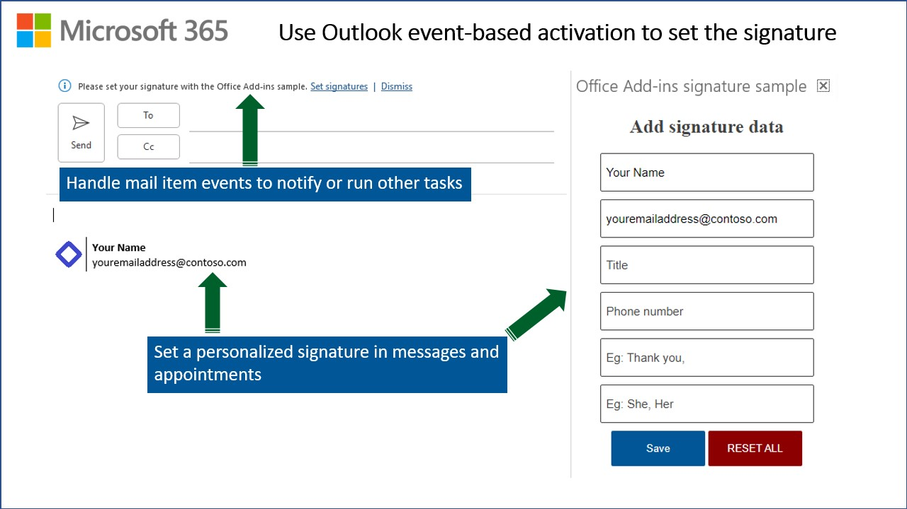

# Use Outlook event-based activation to set the signature

**Applies to:** Outlook on Windows | Outlook on the web | Outlook on Mac (new UI)

## Summary

This sample uses event-based activation to run an Outlook add-in when the user creates a new message or appointment. The add-in can respond to events, even when the task pane isn't open. It also uses the [setSignatureAsync API](https://learn.microsoft.com/javascript/api/outlook/office.body#outlook-office-body-setsignatureasync-member(1)). If no signature is set, the add-in prompts the user to set a signature, and can then open the task pane for the user.



For documentation related to this sample, see [Configure your Outlook add-in for event-based activation](https://learn.microsoft.com/office/dev/add-ins/outlook/autolaunch).

## Features

- Use event-based activation to respond to events when the task pane isn't open.
- Set a signature for Outlook to use in messages and appointments.

## Applies to

- Outlook
  - Windows
  - Web browser
  - new Mac UI

## Prerequisites

- Microsoft 365

    > **Note**: If you don't have a Microsoft 365 subscription, you can get one for development purposes by signing up for the [Microsoft 365 developer program](https://developer.microsoft.com/office/dev-program).

- A recent version of [npm](https://www.npmjs.com/get-npm) and [Node.js](https://nodejs.org/en/) installed on your computer. These are required if you want to run the web server on localhost. To check if you have already installed these tools, run the commands `node -v` and `npm -v` in your terminal.
- [Teams Toolkit extension for VS Code](https://learn.microsoft.com/microsoftteams/platform/toolkit/install-teams-toolkit) if you want to deploy the sample to Microsoft Azure with the [unified Microsoft 365 manifest](https://learn.microsoft.com/office/dev/add-ins/develop/json-manifest-overview).

## Solution

| Solution | Author(s) |
|---------|----------|
| Use Outlook event-based activation to set the signature | Microsoft |

## Version history

| Version  | Date | Comments |
|---------|------|---------|
| 1.0 | 4-1-2021 | Initial release |
| 1.1 | 6-1-2021 | Update for GA of setSignature API |
| 1.2 | 7-27-2021 | Convert to GitHub hosting |
| 1.3 | 4-17-2023 | Add support for unified Microsoft 365 manifest |

## Scenario: Event-based activation

In this scenario, the add-in helps the user manage their email signature, even when the task pane isn't open. When the user sends a new message, or creates a new appointment, the add-in displays an information bar prompting the user to create a signature. If the user chooses to set a signature, the add-in opens the task pane for the user to continue setting their signature.

## Run the sample

There are multiple ways to run this sample.

### Run the sample using GitHub as the web host

The quickest way to run the sample is to use GitHub as the web host.However you can't debug or change the source code. The add-in web files are served from this repo on GitHub.

1. Download the **manifest.xml** file from this sample to a folder on your computer.
1. Sideload the add-in manifest in Outlook on the web, on Windows, or on Mac by following the instructions in the article [Sideload Outlook add-ins for testing](https://learn.microsoft.com/office/dev/add-ins/outlook/sideload-outlook-add-ins-for-testing).

### Run the sample on localhost with the unified Microsoft 365 manifest

You can run the sample using the [unified Microsoft 365 manifest](https://learn.microsoft.com/office/dev/add-ins/develop/json-manifest-overview) which is currently in preview. We encourage you to experiment with the unified manifest, but don't use the unified manifest for production add-ins.

1. Clone or download this repository.
1. From the command line, or a terminal window, go to the project folder ```/samples/outlook-set-signature```.
1. Run the following commands.

    ```console
    npm install
    npm run start:unified
    ```

This will start the web server on localhost. When you want to stop the web server, run `npm run stop:unified`.

To debug task pane code, see [Debug add-ins on Windows using Visual Studio Code and Microsoft Edge WebView2 (Chromium-based)](https://learn.microsoft.com/office/dev/add-ins/testing/debug-desktop-using-edge-chromium) and related articles.

>Note: You can't debug event-based activation code using the unified manifest at this time.

### Run the sample on localhost with manifest.xml

You can host the web server on localhost and use the manifest.xml file to sideload and run the sample. This supports debugging and production deployments.

1. Run the following commands.

    ```console
    npm install
    npm run start
    ```

To debug event-based activation code, see [Debug your event-based Outlook add-in](https://learn.microsoft.com/office/dev/add-ins/outlook/debug-autolaunch)

To debug task pane code, see [Debug add-ins on Windows using Visual Studio Code and Microsoft Edge WebView2 (Chromium-based)](https://learn.microsoft.com/office/dev/add-ins/testing/debug-desktop-using-edge-chromium) and related articles.

### Try it out

Once the add-in is loaded use the following steps to try out the functionality.

1. Open Outlook on Windows, on Mac, or in a browser.
1. Create a new message or appointment.

    > You should see a notification at the top of the message that reads: **Please set your signature with the Office Add-ins sample.**

1. Choose **Set signatures**. This will open the task pane for the add-in.
1. In the task pane fill out the fields for your signature data. Then choose **Save**.
1. The task pane will load a page of sample templates. You can assign the templates to a **New Mail**, **Reply**, or **Forward** action. Once you've assign the templates you want to use, choose **Save**.

The next time you create a message or appointment, you'll see the signature you selected applied by the add-in.

## Deploy to Azure

This sample supports deployment to Azure with the unified manifest. There are two approaches to deploy the sample to Azure: Use Visual Studio Code, or Use TeamsFx CLI.

### From Visual Studio Code

1. Open Teams Toolkit, and sign into Azure by choosing `Sign in to Azure` under the **ACCOUNTS** section from sidebar.
1. After you sign in, select a subscription under your account.
1. Choose `Provision in the cloud` from the **DEVELOPMENT** section or open the command palette and select: `Teams: Provision in the cloud`.
1. Choose `Deploy to the cloud` or open the command palette and select: `Teams: Deploy to the cloud`.

### From TeamsFx CLI

Run the following commands:

```console
teamsfx account login azure
teamsfx provision --env dev
teamsfx deploy --env dev
```

> Note: Provisioning and deployment may incur charges to your Azure subscription.

The previous steps provision a new storage account in your Azure subscription and enable it to server static HTML content.

Once the sample is successfully deployed follow these steps:

1. Open the `./webpack.config.js` file.
1. Change the `urlProd` constant to use the endpoint of your new Azure deployment. The correct endpoint is listed in the VS Code **OUTPUT** window from running previous commands. Or you can go to your Azure portal and go to the new storage account. Then choose **Data management > Static website** and copy the **Primary endpoint** value.
1. Save the changes to `webpack.config.js` and run the `npm run build` command. This will generate a new `manifest.json` file in the `dist` folder that will load the add-in resources from your storage account.
1. Run the command `npm run start:unified:prod` to start Outlook and sideload the manifest.json from the `dist` folder. Outlook will start and then load the sample add-in from the deployed storage account.

## Key parts of this sample

The manifest configures a runtime that is loaded specifically to handle event-based activation.

### Configure event-based activation in the manifest.xml file

The following `<Runtime>` element specifies an HTML page resource ID that loads the runtime on Outlook on the web and on Mac. The `<Override>` element specifies the JavaScript file instead, to load the runtime for Outlook on Windows. Outlook on Windows doesn't use the HTML page to load the runtime.

```xml
<Runtime resid="Autorun">
  <Override type="javascript" resid="runtimeJs"/>
...
<bt:Url id="Autorun" DefaultValue="https://officedev.github.io/Office-Add-in-samples/Samples/outlook-set-signature/src/runtime/HTML/autorunweb.html"></bt:Url>
<bt:Url id="runtimeJs" DefaultValue="https://officedev.github.io/Office-Add-in-samples/Samples/outlook-set-signature/src/runtime/Js/autorunshared.js"></bt:Url>
```

The add-in handles two events that are mapped to the `checkSignature()` function.

`manifest.xml`

```xml
<LaunchEvents>
  <LaunchEvent Type="OnNewMessageCompose" FunctionName="checkSignature" />
  <LaunchEvent Type="OnNewAppointmentOrganizer" FunctionName="checkSignature" />
</LaunchEvents>
```

### Configure event-based activation in the unified manifest file

If you use the unified manifest, the `manifest.json` file it specifies an HTML page resource ID that loads the runtime on Outlook on the web and on Mac. The `runtimes` array includes a runtime entry that describes the event-based activation required. The `code` object identities the HTML file to load. It also identifies a Javascript file to load when using Outlook on Windows.

```json
 "runtimes": [
                {
                    "requirements": {
                        "capabilities": [
                            {
                                "name": "Mailbox",
                                "minVersion": "1.5"
                            }
                        ]
                    },
                    "id": "runtime_1",
                    "type": "general",
                    "code": {
                        "page": "https://localhost:3000/autorunweb.html",
                        "script": "https://localhost:3000/autorunshared.js"
                    },
                    "lifetime": "short",
                    "actions": [
                        {
                            "id": "checkSignature",
                            "type": "executeFunction",
                            "displayName": "checkSignature"
                        }
                    ]
                },
...
```

The add-in handles two events that are mapped to the `checkSignature()` function. They are described in the `autoRunEvents` array. Note that the `actionID` must match an `id` specified in the previous `actions` array.

```json
 "autoRunEvents": [
      {
          "requirements": {
              "capabilities": [
                  {
                      "name": "Mailbox",
                      "minVersion": "1.5"
                  }
              ],
              "scopes": [
                  "mail"
              ]
          },
          "events": [
              {
                  "type": "newMessageComposeCreated",
                  "actionId": "checkSignature"
              },
              {
                  "type": "newAppointmentOrganizerCreated",
                  "actionId": "checkSignature"
              }
          ]
      }
  ],
```

### Handling the events and using the setSignatureAsync API

When the user creates a new message or appointment, Outlook will load the files specified in the manifest to handle the `OnNewMessageCompose` and `OnNewAppointmentOrganizer` events. Outlook on the web and on Mac will load the `autorunweb.html` page, which then also loads `autorunweb.js` and `autorunshared.js`.

The `autorunweb.js` file contains a version of the `insert_auto_signature` function used specifically when running on Outlook on the web. The [setSignatureAsync() API cannot be used in Outlook on the web for appointments](https://learn.microsoft.com/javascript/api/outlook/office.body#outlook-office-body-setsignatureasync-member(1)). Therefore, `insert_auto_signature` inserts the signature into a new appointment by directly writing to the body text of the appointment.

The `autorunshared.js` file contains the `checkSignature` function that handles the events from Outlook. It also contains additional code that is shared and loaded when the add-in is used in Outlook on the web, on Windows, and on Mac. In Outlook on Windows, this file is loaded directly and `autorunweb.html` and `autorunweb.js` aren't loaded.

The `autorunshared.js` file contains a version of the `insert_auto_signature` function that uses the `setSignatureAsync()` API to set the signature for both messages and appointments.

Note that you can use a similar pattern when handling events. If you need code that only applies to Outlook on the web, you can load it in a separate file like `autorunweb.js`. And for code that applies to Outlook on the web, on Windows, and on Mac, you can load it in a shared file like `autorunshared.js`.

### Embedding images with the signature

Template A shows how to insert an image by embedding it in the signature. This will avoid the image being downloaded from your server when the signature is inserted into new mail items. The HTML uses the following `` tag format with the **src** set to **cid:*imageFileName*** to embed the image.

```xml
str +=
    "<td style='border-right: 1px solid #000000; padding-right: 5px;'></td>";
```

In the **addTemplateSignature** function, if template A is used, it will attach the image by calling the **addFileAttachmentFromBase64Async()** API. Then it calls the **setSignatureAsync()** API.

### Referencing images from the signature

Template B shows how to reference an image from the HTML. It uses the `` tag and references the web location.

```xml
 str +=
    "<td style='border-right: 1px solid #000000; padding-right: 5px;'></td>";
```

This is a simpler approach as you don't need to attach the image. Although your web server will need to provide the image anytime Outlook needs it for a signature.

### Task pane code

The task pane code is located under the `taskpane` folder of this project. The task pane HTML and JavaScript files only provide UI and functionality to let the user specify and save a signature.

- `editsignature.html` is loaded when the task pane first opens. It lets the user enter details such as name and title for their signature.
- `assignsignature.html` is loaded when the user saves their details from the `editsignature.html` page. It lets the user assign the signature to actions such as "new email", "reply", and "forward.

## Questions and feedback

- Did you experience any problems with the sample? [Create an issue](https://github.com/OfficeDev/Office-Add-in-samples/issues/new/choose) and we'll help you out.
- We'd love to get your feedback about this sample. Go to our [Office samples survey](https://aka.ms/OfficeSamplesSurvey) to give feedback and suggest improvements.
- For general questions about developing Office Add-ins, go to [Microsoft Q&A](https://learn.microsoft.com/answers/topics/office-js-dev.html) using the office-js-dev tag.

## Copyright

Copyright (c) 2021 Microsoft Corporation. All rights reserved.

This project has adopted the [Microsoft Open Source Code of Conduct](https://opensource.microsoft.com/codeofconduct/). For more information, see the [Code of Conduct FAQ](https://opensource.microsoft.com/codeofconduct/faq/) or contact [opencode@microsoft.com](mailto:opencode@microsoft.com) with any additional questions or comments.


