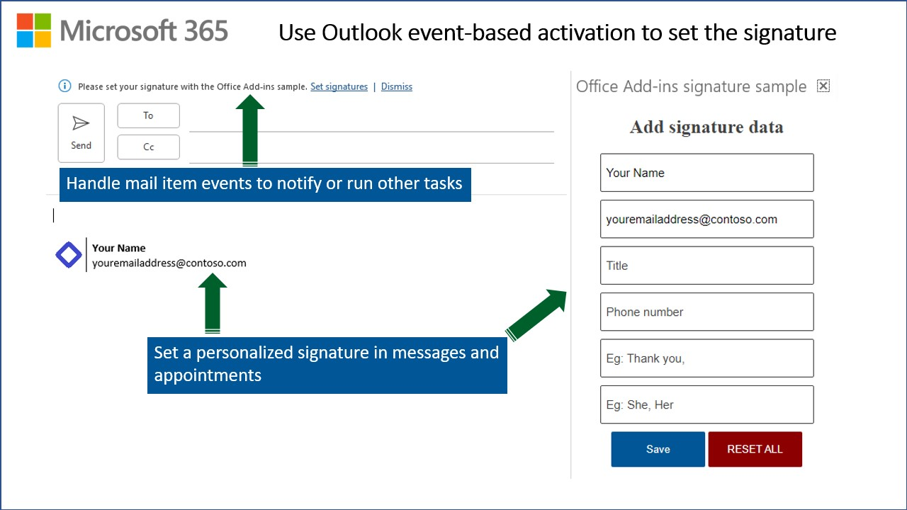

# Set your signature using Outlook event-based activation

**Applies to:** Outlook on Windows ([new](https://support.microsoft.com/office/656bb8d9-5a60-49b2-a98b-ba7822bc7627) and classic) | Outlook on the web | Outlook on Mac

## Summary

This sample uses event-based activation to run an Outlook add-in when the user creates a new message or appointment. The add-in can respond to events, even when the task pane isn't open. It also uses the [setSignatureAsync API](https://learn.microsoft.com/javascript/api/outlook/office.body#outlook-office-body-setsignatureasync-member(1)). If no signature is set, the add-in prompts the user to set a signature, and can then open the task pane for the user.



For documentation related to this sample, see [Activate add-ins with events](https://learn.microsoft.com/office/dev/add-ins/develop/event-based-activation).

## Features

- Respond to the `OnNewMessageCompose` and `OnNewAppointmentOrganizer` events to insert a signature into the mail item or provide an option to customize a signature in the task pane.
- Set a signature for Outlook to use in messages and appointments.

## Applies to

Outlook clients that support [requirement set 1.10](https://learn.microsoft.com/javascript/api/requirement-sets/outlook/outlook-requirement-set-1-10).

- Windows (new and classic)
- Web browser
- new Mac UI

For guidance on supported requirement sets, see [Outlook client support](https://learn.microsoft.com/javascript/api/requirement-sets/outlook/outlook-api-requirement-sets#outlook-client-support).

## Prerequisites

- Microsoft 365

    > **Note**: If you don't have a Microsoft 365 subscription, you might qualify for a Microsoft 365 E5 developer subscription for development purposes through the [Microsoft 365 Developer Program](https://aka.ms/m365devprogram); for details, see the [FAQ](https://learn.microsoft.com/office/developer-program/microsoft-365-developer-program-faq#who-qualifies-for-a-microsoft-365-e5-developer-subscription-). Alternatively, you can [sign up for a 1-month free trial](https://www.microsoft.com/microsoft-365/try) or [purchase a Microsoft 365 plan](https://www.microsoft.com/microsoft-365/business/compare-all-microsoft-365-business-products-g).

- A recent version of [npm](https://www.npmjs.com/get-npm) and [Node.js](https://nodejs.org/en/) installed on your computer. These are required if you want to run the web server on localhost. To check if you have already installed these tools, run the commands `node -v` and `npm -v` in your terminal.

## Solution

| Solution | Author(s) |
| -------- | --------- |
| Use Outlook event-based activation to set the signature | Microsoft |

## Version history

| Version | Date | Comments |
| ------- | ---- | -------- |
| 1.0 | 04-01-2021 | Initial release |
| 1.1 | 06-01-2021 | Update for GA of setSignature API |
| 1.2 | 07-27-2021 | Convert to GitHub hosting |
| 1.3 | 04-17-2023 | Add support for unified Microsoft 365 manifest |
| 1.4 | 05-20-2024 | Normalize use of unified Microsoft 365 manifest |
| 1.5 | 04-16-2026 | Reorganize the manifest files and apply fixes |

## Scenario: Event-based activation

In this scenario, the add-in helps the user manage their email signature, even when the task pane isn't open. When the user sends a new message, or creates a new appointment, the add-in displays an information bar prompting the user to create a signature. If the user chooses to set a signature, the add-in opens the task pane for the user to continue setting their signature.

## Choose a manifest type

By default, the sample uses an add-in only manifest. However, you can switch the project between the add-in only manifest and the unified manifest for Microsoft 365. For more information about the differences between them, see [Office Add-ins manifest](https://learn.microsoft.com/office/dev/add-ins/develop/add-in-manifests). To continue with the add-in only manifest, skip ahead to the [Run the sample](#run-the-sample) section.

> [!NOTE]
> The unified manifest for Microsoft 365 isn't directly supported in Outlook on Mac. Run the sample with the add-in only manifest instead. For more information about clients and platforms supported by the unified manifest, see [Office Add-ins with the unified app manifest for Microsoft 365](https://learn.microsoft.com/office/dev/add-ins/develop/unified-manifest-overview#client-and-platform-support).

### To switch to the unified manifest for Microsoft 365

Copy all the files from the **manifest-configurations/unified** subfolder to the sample's root folder, replacing any existing files that have the same names. We recommend that you delete the **manifest.xml** and **manifest-localhost.xml** files from the root folder, so only files needed for the unified manifest are present. Then, [run the sample](#run-the-sample).

### To switch back to the add-in only manifest

To switch back to the add-in only manifest, copy the files from the **manifest-configurations/add-in-only** subfolder to the sample's root folder. We recommend that you delete the **manifest.json** file from the root folder.

## Run the sample

To run the sample, choose whether to host the add-in's web files on localhost or on GitHub.

### Use localhost

1. Clone or download this repository.
1. From a command prompt, go to the root of the project folder **Samples/outlook-set-signature**.
1. Run `npm install`.
1. Run `npm start`. This starts the web server on localhost and sideloads the manifest file.
1. Follow the steps in [Try it out](#try-it-out) to test the sample.
1. To stop the web server and uninstall the add-in, run `npm stop`.

### Use GitHub

> [!NOTE]
> The option to use GitHub as the web host only applies to the add-in only manifest.

The quickest way to run the sample is to use GitHub as the web host. However, you can't debug or change the source code. The add-in web files are served from this GitHub repository.

1. Download the **manifest.xml** file from this sample to a folder on your computer.
1. Sideload the manifest by following the manual instructions in [Sideload Outlook add-ins for testing](https://learn.microsoft.com/office/dev/add-ins/outlook/sideload-outlook-add-ins-for-testing?tabs=xmlmanifest#sideload-manually).
1. Follow the steps in [Try it out](#try-it-out) to test the sample.
1. To uninstall the add-in, follow the instructions in [Remove a sideloaded add-in](https://learn.microsoft.com/office/dev/add-ins/outlook/sideload-outlook-add-ins-for-testing?tabs=xmlmanifest#remove-a-sideloaded-add-in).

### Try it out

Once the add-in is loaded, use the following steps to try out the functionality.

1. Open Outlook on Windows (new or classic), on Mac, or in a browser.
1. Create a new message or appointment.

    > A notification bar with the following message appears at the top of the mail item: **Please set your signature with the Office Add-ins sample.**

1. Choose **Set signatures** from the notification.

    > The add-in's task pane opens to a form for customizing your signature.
1. In the task pane, fill out the fields for your signature data. Then, choose **Save**.

    > The task pane loads a page of signature templates containing the data you provided.
1. Assign a template to a **New Mail**, **Reply**, or **Forward** action. Then, choose **Save**.

The next time you create a message or appointment, you'll see the signature you selected applied by the add-in.

## Key parts of this sample

The manifest configures a runtime that is loaded specifically to handle event-based activation.

### Configure event-based activation in the manifest.xml file

The following `<Runtime>` element specifies an HTML page resource ID that loads the runtime on Outlook on the web, on Mac, and in new Outlook on Windows. The `<Override>` element specifies the JavaScript file instead, to load the runtime for Outlook on Windows. Outlook on Windows doesn't use the HTML page to load the runtime.

```xml
<Runtime resid="Autorun">
  <Override type="javascript" resid="runtimeJs"/>
...
<bt:Url id="Autorun" DefaultValue="https://officedev.github.io/Office-Add-in-samples/Samples/outlook-set-signature/src/runtime/HTML/autorunweb.html"></bt:Url>
<bt:Url id="runtimeJs" DefaultValue="https://officedev.github.io/Office-Add-in-samples/Samples/outlook-set-signature/src/runtime/Js/autorunshared.js"></bt:Url>
```

The add-in handles two events that are mapped to the `checkSignature()` function.

`manifest.xml`

```xml
<LaunchEvents>
  <LaunchEvent Type="OnNewMessageCompose" FunctionName="checkSignature" />
  <LaunchEvent Type="OnNewAppointmentOrganizer" FunctionName="checkSignature" />
</LaunchEvents>
```

### Configure event-based activation in the unified manifest file

If you use the unified manifest, the `manifest.json` file specifies an HTML page resource ID that loads the runtime on Outlook on the web, on Mac, and in new Outlook on Windows. The `runtimes` array includes a runtime entry that describes the event-based activation required. The `code` object identifies the HTML file to load. It also identifies a JavaScript file to load when using Outlook on Windows.

```json
 "runtimes": [
    {
        "id": "runtime_1",
        "type": "general",
        "code": {
            "page": "https://localhost:3000/autorunweb.html",
            "script": "https://localhost:3000/autorunshared.js"
        },
        "lifetime": "short",
        "actions": [
            {
                "id": "checkSignature",
                "type": "executeFunction"
            }
        ]
    },
    ...
 ],
```

The add-in handles two events that are mapped to the `checkSignature()` function. They are described in the `autoRunEvents` array. Note that the `actionId` must match an `id` specified in the previous `actions` array.

```json
"autoRunEvents": [
    {
        "requirements": {
            "capabilities": [
                {
                    "name": "Mailbox",
                    "minVersion": "1.10"
                }
            ],
            "scopes": [
                "mail"
            ]
        },
        "events": [
            {
                "type": "newMessageComposeCreated",
                "actionId": "checkSignature"
            },
            {
                "type": "newAppointmentOrganizerCreated",
                "actionId": "checkSignature"
            }
        ]
    }
],
```

### Handle the events and use the setSignatureAsync API

When the user creates a new message or appointment, Outlook loads the files specified in the manifest to handle the `OnNewMessageCompose` and `OnNewAppointmentOrganizer` events. Outlook on the web, on Mac, and new Outlook on Windows load the `autorunweb.html` page, which then also loads `autorunweb.js` and `autorunshared.js`.

The `autorunweb.js` file contains a version of the `insert_auto_signature` function used specifically when running on Outlook on the web or new Outlook on Windows. The [setSignatureAsync() API can't be used in Outlook on the web or new Outlook on Windows for appointments](https://learn.microsoft.com/javascript/api/outlook/office.body#outlook-office-body-setsignatureasync-member(1)). Therefore, `insert_auto_signature` inserts the signature into a new appointment by directly writing to the body text of the appointment.

The `autorunshared.js` file contains the `checkSignature` function that handles the events from Outlook. It also contains additional code that's shared and loaded when the add-in is used in Outlook on the web, on Windows (new and classic), and on Mac. In classic Outlook on Windows, this file is loaded directly and `autorunweb.html` and `autorunweb.js` aren't loaded.

The `autorunshared.js` file contains a version of the `insert_auto_signature` function that uses the `setSignatureAsync()` API to set the signature for both messages and appointments.

Note that you can use a similar pattern when handling events. If you need code that only applies to Outlook on the web and new Outlook on Windows, you can load it in a separate file like `autorunweb.js`. For code that applies to Outlook on the web, on Windows (new and classic), and on Mac, you can load it in a shared file like `autorunshared.js`.

### Embedding images with the signature

Template A shows how to insert an image by embedding it in the signature. This avoids the image being downloaded from your server when the signature is inserted into new mail items. The HTML uses the following `` tag format with the **src** set to **cid:*imageFileName*** to embed the image.

```xml
str +=
    "<td style='border-right: 1px solid #000000; padding-right: 5px;'></td>";
```

In the `addTemplateSignature` function, if template A is used, it attaches the image by calling the `addFileAttachmentFromBase64Async()` API. Then, it calls the `setSignatureAsync()` API.

### Referencing images from the signature

Template B shows how to reference an image from the HTML. It uses the `` tag and references the web location.

```xml
 str +=
    "<td style='border-right: 1px solid #000000; padding-right: 5px;'></td>";
```

This is a simpler approach because you don't need to attach the image. However, your web server must provide the image whenever Outlook needs it for a signature.

### Task pane code

The task pane code is located under the `taskpane` folder of this project. The task pane HTML and JavaScript files only provide UI and functionality to let the user specify and save a signature.

- `editsignature.html` is loaded when the task pane first opens. It lets the user enter details such as name and title for their signature.
- `assignsignature.html` is loaded when the user saves their details from the `editsignature.html` page. It lets the user assign the signature to actions, such as **New Mail**, **Reply**, or **Forward**.

## Questions and feedback

- Did you experience any problems with the sample? [Create an issue](https://github.com/OfficeDev/Office-Add-in-samples/issues/new/choose) and we'll help you out.
- We'd love to get your feedback about this sample. Go to our [Office samples survey](https://aka.ms/OfficeSamplesSurvey) to give feedback and suggest improvements.
- For general questions about developing Office Add-ins, go to [Microsoft Q&A](https://learn.microsoft.com/answers/topics/office-js-dev.html) using the office-js-dev tag.

## Copyright

Copyright (c) 2021 Microsoft Corporation. All rights reserved.

This project has adopted the [Microsoft Open Source Code of Conduct](https://opensource.microsoft.com/codeofconduct/). For more information, see the [Code of Conduct FAQ](https://opensource.microsoft.com/codeofconduct/faq/) or contact [opencode@microsoft.com](mailto:opencode@microsoft.com) with any additional questions or comments.


