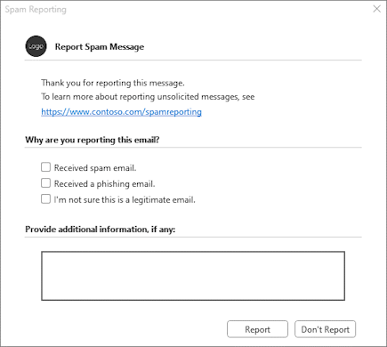
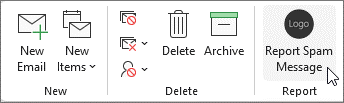
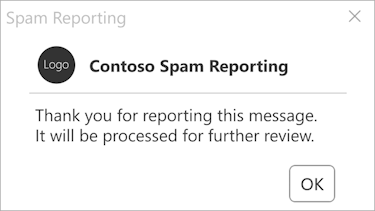

# Report spam or phishing emails in Outlook

**Applies to**: Outlook on the web, Outlook on Windows (new and classic), Outlook on Mac



## Summary

This sample showcases how to build an integrated spam-reporting solution that:

- Is easily discoverable in the Outlook client ribbon.
- Provides the user with a processing dialog to report an email.
- Facilitates saving a copy of the reported email to a file to submit it to your backend system for further processing.

To learn about key components of this sample, see [Implement an integrated spam-reporting add-in](https://learn.microsoft.com/office/dev/add-ins/outlook/spam-reporting).

## Applies to

- Outlook on the web
- [new Outlook on Windows](https://support.microsoft.com/office/656bb8d9-5a60-49b2-a98b-ba7822bc7627)
- classic Outlook on Windows starting in Version 2307 (Build 16626.10000)
- Outlook on Mac starting in Version 16.100 (25072537)

## Prerequisites

- A Microsoft 365 subscription.

    > **Note**: If you don't have a Microsoft 365 subscription, you might qualify for a free developer subscription that's renewable for 90 days and comes configured with sample data. For details, see the [Microsoft 365 Developer Program FAQ](https://learn.microsoft.com/office/developer-program/microsoft-365-developer-program-faq#who-qualifies-for-a-microsoft-365-e5-developer-subscription-).

- (Optional) If you want to run the web server on localhost, install a recent version of [npm](https://www.npmjs.com/get-npm) and [Node.js](https://nodejs.org) on your computer. To check if you've already installed these tools, from a command prompt, run the following commands.

    ```console
    node -v
    npm -v
    ```

- (Optional) If you want to run the sample with a [unified manifest for Microsoft 365](https://learn.microsoft.com/office/dev/add-ins/develop/json-manifest-overview) using GitHub as the web host, install the [Microsoft 365 Agents Toolkit command line interface (CLI)](https://learn.microsoft.com/microsoftteams/platform/toolkit/microsoft-365-agents-toolkit-cli). From a command prompt, run the following command.

    ```console
    npm install -g @microsoft/m365agentstoolkit-cli
    ```

## Run the sample

Run this sample with a [unified manifest for Microsoft 365](#run-with-the-unified-manifest-for-microsoft-365) or [add-in only manifest](#run-with-the-add-in-only-manifest). Use one of the following add-in file hosting options.

> [!NOTE]
>
> - The spam-reporting sample with the unified manifest for Microsoft 365 is currently only supported in classic Outlook on Windows. To run the sample in Outlook on the web or the new Outlook on Windows, use the add-in only manifest.
>
> - To learn more about manifests, see [Office Add-ins manifest](https://learn.microsoft.com/office/dev/add-ins/develop/add-in-manifests).

### Run with the unified manifest for Microsoft 365

#### Use GitHub as the web host

The quickest way to run the sample is to use GitHub as the web host. However, you can't debug or change the source code. The add-in web files are served from this GitHub repository.

1. Download the **outlook-spam-reporting.zip** file from this sample to a folder on your computer.
1. Sideload the sample to Outlook by following the instructions in [Sideload with Microsoft 365 Agents Toolkit CLI (command-line interface)](https://learn.microsoft.com/office/dev/add-ins/testing/sideload-add-in-with-unified-manifest#sideload-with-microsoft-365-agents-toolkit-cli-command-line-interface).
1. Follow the steps in [Try it out](#try-it-out) to test the sample.
1. To uninstall the add-in from Outlook, run the following command. Replace *{title ID}* with the add-in's title ID that was generated when you sideloaded the add-in.

    ```console
    atk uninstall --mode title-id --title-id {title ID} --interactive false
    ```

#### Use localhost

If you prefer to host the web server on localhost, follow these steps.

1. Clone or download this repository.
1. From a command prompt, go to the root of the project folder **/samples/outlook-spam-reporting**.
1. Run the following commands.

    ```console
    npm install
    npm start
    ```

    This starts the web server on localhost and sideloads the **manifest.json** file to Outlook.

1. Follow the steps in [Try it out](#try-it-out) to test the sample.

    > **Tip**: To debug a spam-reporting add-in, see [Debug your event-based or spam-reporting Outlook add-in](https://learn.microsoft.com/office/dev/add-ins/outlook/debug-autolaunch).

1. To stop the web server and uninstall the add-in from Outlook, run the following command.

    ```console
    npm stop
    ```

### Run with the add-in only manifest

#### Use GitHub as the web host

The quickest way to run the sample is to use GitHub as the web host. However, you can't debug or change the source code. The add-in web files are served from this GitHub repository.

1. Download the **manifest.xml** file from this sample to a folder on your computer.
1. Sideload the add-in only manifest in Outlook on the web or on Windows (new or classic) by following the manual instructions in [Sideload Outlook add-ins for testing](https://learn.microsoft.com/office/dev/add-ins/outlook/sideload-outlook-add-ins-for-testing?tabs=xmlmanifest#sideload-manually).
1. Follow the steps in [Try it out](#try-it-out) to test the sample.
1. To uninstall the add-in from Outlook, follow the instructions in [Remove a sideloaded add-in](https://learn.microsoft.com/office/dev/add-ins/outlook/sideload-outlook-add-ins-for-testing?tabs=xmlmanifest#remove-a-sideloaded-add-in).

#### Use localhost

If you prefer to host the web server on localhost, follow these steps.

1. Clone or download this repository.
1. From a command prompt, run the following commands.

    ```console
    npm install
    npm run start:xml
    ```

    This starts the web server on localhost and sideloads the **manifest-localhost.xml** file to Outlook.

1. Follow the steps in [Try it out](#try-it-out) to test the sample.

    > **Tip**: To debug a spam-reporting add-in, see [Debug your event-based or spam-reporting Outlook add-in](https://learn.microsoft.com/office/dev/add-ins/outlook/debug-autolaunch).

1. To stop the web server and uninstall the add-in from Outlook, run the following command.

    ```console
    npm run stop:xml
    ```

## Try it out

Once the add-in is loaded in Outlook, use the following steps to try out its functionality. The images in the following steps show how the spam-reporting add-in and its dialogs appear in classic Outlook on Windows. Note that the appearance may vary depending on your Outlook client.

1. Choose a message from your inbox, then select the add-in's button from the ribbon.

    
1. In the preprocessing dialog, choose a reason for reporting the message and add information about the message, if configured. Then, select **Report**.

    
1. In the post-processing dialog, select **OK**.

    

## References

- [Implement an integrated spam-reporting add-in](https://learn.microsoft.com/office/dev/add-ins/outlook/spam-reporting)
- [ReportPhishingCommandSurface Extension Point](https://learn.microsoft.com/javascript/api/manifest/extensionpoint?#reportphishingcommandsurface)
- [Office.MessageRead.getAsFileAsync() method](https://learn.microsoft.com/javascript/api/outlook/office.messageread#outlook-office-messageread-getasfileasync-member(1))
- [Troubleshoot event-based and spam-reporting add-ins](https://learn.microsoft.com/office/dev/add-ins/outlook/troubleshoot-event-based-and-spam-reporting-add-ins)
- [Debug your event-based or spam-reporting Outlook add-in](https://learn.microsoft.com/office/dev/add-ins/outlook/debug-autolaunch)
- [Microsoft Office Add-in Debugger Extension for Visual Studio Code](https://learn.microsoft.com/office/dev/add-ins/testing/debug-with-vs-extension)
- [Develop Office Add-ins with Visual Studio Code](https://learn.microsoft.com/office/dev/add-ins/develop/develop-add-ins-vscode)
- [Office Add-ins with Visual Studio Code](https://code.visualstudio.com/docs/other/office)
- [Debugging with Visual Studio Code](https://code.visualstudio.com/docs/editor/debugging)
- [Node.js debugging in VS Code](https://code.visualstudio.com/docs/nodejs/nodejs-debugging)
- [Office-Addin-Debugging](https://www.npmjs.com/package/office-addin-debugging)

## Questions and feedback

- Did you experience any problems with the sample? [Create an issue](https://github.com/OfficeDev/Office-Add-in-samples/issues/new/choose) and we'll help you out.
- We'd love to get your feedback about this sample. Go to our [Office samples survey](https://aka.ms/OfficeSamplesSurvey) to give feedback and suggest improvements.
- For general questions about developing Office Add-ins, go to [Microsoft Q&A](https://learn.microsoft.com/answers/topics/office-js-dev.html) using the office-js-dev tag.

## Copyright

Copyright (c) 2024 Microsoft Corporation. All rights reserved.

This project has adopted the [Microsoft Open Source Code of Conduct](https://opensource.microsoft.com/codeofconduct/). For more information, see the [Code of Conduct FAQ](https://opensource.microsoft.com/codeofconduct/faq/) or contact [opencode@microsoft.com](mailto:opencode@microsoft.com) with any additional questions or comments.

## Solution

| Solution | Author(s) |
| ----- | ----- |
| Report spam or phishing emails in Outlook | [Eric Legault](https://www.linkedin.com/in/ericlegault/) |

## Version history

| Version | Date | Comments |
| ----- | ----- | ----- |
| 1.0 | March 26, 2024 | Initial release |
| 1.1 | July 1, 2024 | Create separate JavaScript files for supported clients |
| 1.2 | September 11, 2024 | Correct the `Office.actions.associate` call and consolidate the JavaScript files |
| 1.3 | February 28, 2025 | Add support for the unified manifest for Microsoft 365 |
| 1.4 | August 26, 2025 | Note support for Outlook on Mac |


