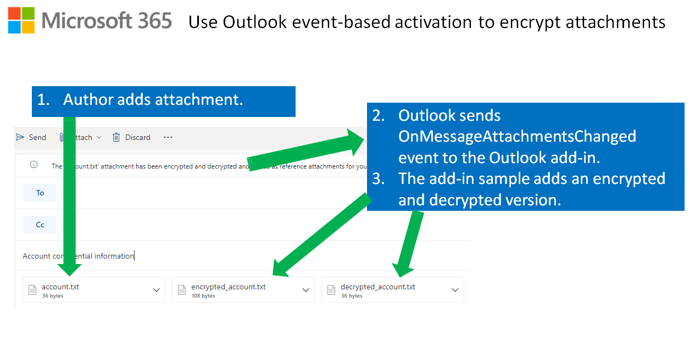

# Use Outlook event-based activation to tag external recipients

**Applies to:** Outlook on Windows | Outlook on the web

## Summary

This sample uses event-based activation to run an Outlook add-in when the user changes recipients while composing a message. The add-in also uses the [appendOnSendAsync API](https://docs.microsoft.com/javascript/api/outlook/office.body?view=outlook-js-1.11#appendOnSendAsync_data__options__callback_). If external recipients are added, the add-in prepends "[External]" to the message subject and appends a disclaimer to the message body on send.



For documentation related to this sample, see [Configure your Outlook add-in for event-based activation](https://docs.microsoft.com/office/dev/add-ins/outlook/autolaunch).

## Features

- Use event-based activation to respond to changes in message recipients during compose mode.
- Update the message subject to indicate there are external recipients.
- Add a disclaimer to messages sent to external recipients.

## Applies to

- Outlook
  - Windows
  - web browser

## Prerequisites

- Microsoft 365

    > **Note**: If you do not have a Microsoft 365 subscription, you can get one for development purposes by signing up for the [Microsoft 365 developer program](https://developer.microsoft.com/office/dev-program).

## Solution

| Solution | Authors |
|---------|----------|
| Use Outlook event-based activation to tag a message with external recipients | Microsoft |

## Version history

Version  | Date | Comments
|---------|------|---------|
| 1.0 | 7-6-2021 | Initial release |
| 1.1 | 11-1-2021 | Update for GA of SessionData API and OnMessageRecipientsChanged event |

----------

## Scenario: Event-based activation

In this scenario, if the message has external recipients, the add-in prepends "[External]" to the message subject. When the user sends an email message that includes external recipients, the add-in appends a disclaimer to the message.

## Run the sample

You can run this sample in Outlook on Windows or in a browser. The add-in web files are served from this repo on GitHub.

1. Download the **manifest.xml** file from this sample to a folder on your computer.
1. Sideload the add-in manifest in Outlook on the web or on Windows by following the manual instructions in the article [Sideload Outlook add-ins for testing](https://docs.microsoft.com/office/dev/add-ins/outlook/sideload-outlook-add-ins-for-testing).

### Try it out

Once the add-in is loaded, use the following steps to try out the functionality.

1. Open Outlook on Windows or in a browser.
1. Create a new message.
1. Add a recipient email address that's external to your organization.

    > Notice that "[External]" is inserted at the beginning of the subject.

1. Send the email.

    > Navigate to your **Sent Items** folder, open the email you sent, and notice the included disclaimer.

## Run the sample from localhost

If you prefer to host the web server for the sample on your computer, follow these steps:

1. You need http-server to run the local web server. If you haven't installed this yet, run the following command.

    ```console
    npm install --global http-server
    ```

1. Use a tool such as openssl to generate a self-signed certificate that you can use for the web server. Move the cert.pem and key.pem files to the root folder for this sample.
1. From a command prompt, go to the root folder and run the following command.

    ```console
    http-server -S --cors . -p 3000
    ```

1. To reroute to localhost, run office-addin-https-reverse-proxy. If you haven't installed this, run the following command.

    ```console
    npm install --global office-addin-https-reverse-proxy 
    ```

    To reroute, run the following in another command prompt.

    ```console
    office-addin-https-reverse-proxy --url http://localhost:3000 
    ```

1. Sideload `manifest-localhost.xml` in Outlook on the web or on Windows by following the manual instructions in the article [Sideload Outlook add-ins for testing](https://docs.microsoft.com/office/dev/add-ins/outlook/sideload-outlook-add-ins-for-testing).
1. [Try out the sample!](#try-it-out)

## Configure event-based activation and AppendOnSend in the manifest

The manifest configures a runtime that is loaded specifically to handle event-based activation. The following `<Runtime>` element specifies an HTML page resource ID that loads the runtime in Outlook on the web. The `<Override>` element specifies the JavaScript file to load the runtime for Outlook on Windows because Outlook on Windows doesn't use the HTML page to load the runtime.

```xml
<Runtime resid="WebViewRuntime.Url">
  <Override type="javascript" resid="JSRuntime.Url"/>
</Runtime>
...
<bt:Url id="WebViewRuntime.Url" DefaultValue="https://officedev.github.io/Office-Add-in-samples/Samples/outlook-tag-external/src/commands.html" />
<bt:Url id="JSRuntime.Url" DefaultValue="https://officedev.github.io/Office-Add-in-samples/Samples/outlook-tag-external/src/commands/commands.js" />
```

The add-in handles the `OnMessageRecipientsChanged` event that is mapped to the `tagExternal_onMessageRecipientsChangedHandler` function in the `commands.js` file.

```xml
<LaunchEvents>
  <LaunchEvent Type="OnMessageRecipientsChanged" FunctionName="tagExternal_onMessageRecipientsChangedHandler" />
</LaunchEvents>
```

```js
Office.actions.associate("tagExternal_onMessageRecipientsChangedHandler", tagExternal_onMessageRecipientsChangedHandler);
```

Since the add-in calls `Office.context.mailbox.item.body.appendOnSendAsync`, the `AppendOnSend` extended permission is declared in the manifest.

```xml
<ExtendedPermission>AppendOnSend</ExtendedPermission>
```

## Handle the OnMessageRecipientsChanged event, manage session data, and call the appendOnSendAsync API

When the user composes a message (including replies and forwards) and changes any recipients, Outlook will load the files specified in the manifest to handle the `OnMessageRecipientsChanged` event. Outlook on the web loads the **commands.html** page, which then also loads **commands.js**. In Outlook on Windows, **commands.js** is loaded directly but **commands.html** is not loaded.

The **commands.js** file contains the `tagExternal_onMessageRecipientsChangedHandler` function that handles the `OnMessageRecipientsChanged` event from Outlook.

Also, the **commands.js** file contains the following helper functions.

- `checkForExternalTo`: Determines if there are any external users in the **To** field then sets a [SessionData](https://docs.microsoft.com/javascript/api/outlook/office.messagecompose?view=outlook-js-1.11#sessionData) key named **tagExternalTo**.
- `checkForExternalCc`: Determines if there are any external users in the **Cc** field then sets a [SessionData](https://docs.microsoft.com/javascript/api/outlook/office.messagecompose?view=outlook-js-1.11#sessionData) key named **tagExternalCc**.
- `checkForExternalBcc`: Determines if there are any external users in the **Bcc** field then sets a [SessionData](https://docs.microsoft.com/javascript/api/outlook/office.messagecompose?view=outlook-js-1.11#sessionData) key named **tagExternalBcc**.
- `_checkForExternal`: Checks if any property is set to `true` in the [SessionData](https://docs.microsoft.com/javascript/api/outlook/office.messagecompose?view=outlook-js-1.11#sessionData) property bag.
- `_tagExternal`:
  - Updates the [subject](https://docs.microsoft.com/javascript/api/outlook/office.messagecompose?view=outlook-js-1.11#subject) to prepend or remove the "[External]" tag.
  - Calls the [appendOnSendAsync](https://docs.microsoft.com/javascript/api/outlook/office.body?view=outlook-js-1.11#appendOnSendAsync_data__options__callback_) to set or clear the disclaimer.

> **Note**
>
> You can use a different pattern to handle events if needed. For example, if you need code that applies only to Outlook on the web but other code that applies to both Outlook on the web and on Windows, you can define separate JavaScript files. For a sample using this pattern, see [Use Outlook event-based activation to set the signature](https://github.com/OfficeDev/PnP-OfficeAddins/tree/main/Samples/outlook-set-signature).

## Known issues

- In Outlook on Windows, the `OnMessageRecipientsChanged` event fires on reply or reply all. The expected behavior is implemented in Outlook on the web where this event doesn't fire in those cases.

## Copyright

Copyright (c) 2021 Microsoft Corporation. All rights reserved.

This project has adopted the [Microsoft Open Source Code of Conduct](https://opensource.microsoft.com/codeofconduct/). For more information, see the [Code of Conduct FAQ](https://opensource.microsoft.com/codeofconduct/faq/) or contact [opencode@microsoft.com](mailto:opencode@microsoft.com) with any additional questions or comments.


