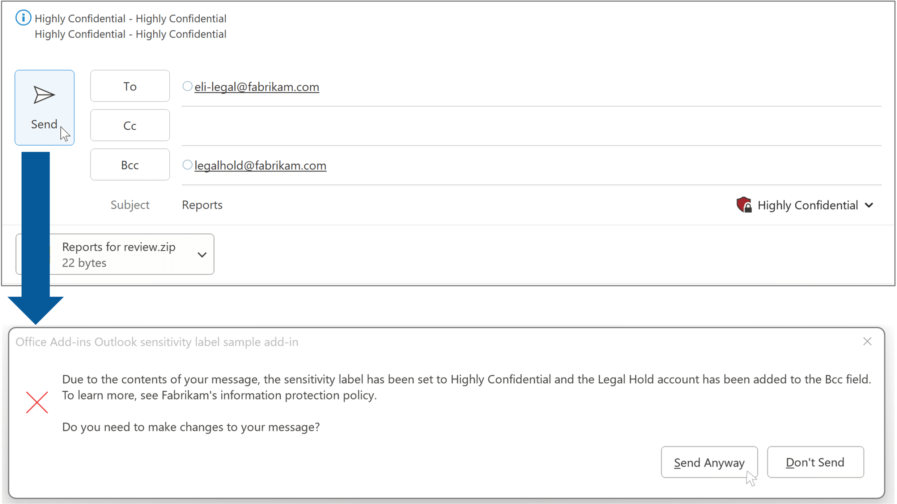

# Verify the sensitivity label of a message

**Applies to**: Outlook on Windows | Outlook on Mac | modern Outlook on the web

## Summary

This sample uses the sensitivity label API in an event-based add-in to verify and apply the **Highly Confidential** sensitivity label to outgoing messages that contain at least one attachment or a recipient who's a member of the fictitious Fabrikam legal team. When the **Highly Confidential** label is applied, a fictitious legal hold account is added to the **Bcc** field of the message.



## Features

- The sensitivity label API is used to:
  - Verify that the catalog of sensitivity labels is enabled on the mailbox where the add-in is installed.
  - Get the available sensitivity labels from the catalog.
  - Get the sensitivity label of a message.
- Event-based activation is used to handle the following events.
  - When the `OnMessageRecipientsChanged` event occurs, the add-in checks if the legal hold account (legalhold@fabrikam.com) was added to the **To**, **Cc**, or **Bcc** field. If the account appears in the **To** or **Cc** field, it's automatically removed from the message. On the other hand, if it was added to the **Bcc** field, the add-in checks whether the sensitivity label of the message is set to **Highly Confidential**. If it isn't, the account is removed from the message.
  - When the `OnSensitivityLabelChanged` event occurs, the add-in checks if the sensitivity label is set to **Highly Confidential**, then adds the legal hold account, if applicable.
  - When the `OnMessageSend` event occurs, the add-in checks whether the message contains an attachment or a recipient who's a member of the Fabrikam legal team. If one of these conditions is met, the sensitivity label of the message is set to **Highly Confidential**. A Smart Alerts dialog is then shown to notify that the sensitivity label was updated.

For documentation related to this sample, see the following:

- [Manage the sensitivity label of your message or appointment in compose mode](https://learn.microsoft.com/office/dev/add-ins/outlook/sensitivity-label)
- [Configure your Outlook add-in for event-based activation](https://learn.microsoft.com/office/dev/add-ins/outlook/autolaunch)
- [Use Smart Alerts and the OnMessageSend and OnAppointmentSend events in your Outlook add-in](https://learn.microsoft.com/office/dev/add-ins/outlook/smart-alerts-onmessagesend-walkthrough)

## Applies to

- Outlook on Windows starting in Version 2304 (Build 16327.20248)
- Outlook on Mac starting in Version 16.71.312.0 (preview)
- Outlook on the web (modern)

## Prerequisites

- A Microsoft 365 E5 subscription. You can get a [free developer sandbox](https://aka.ms/m365/devprogram#Subscription) that provides a renewable 90-day Microsoft 365 E5 subscription for development purposes.
- A [Microsoft 365 Insider Program](https://insider.office.com/join) membership to run the sample in Outlook on Windows and on Mac.
- An enabled catalog of sensitivity labels in Outlook that includes the **Highly Confidential** label. To learn how to configure the sensitivity labels in your tenant, see the following:
  - [Get started with sensitivity labels](https://learn.microsoft.com/microsoft-365/compliance/get-started-with-sensitivity-labels)
  - [Create and configure sensitivity labels and their policies](https://learn.microsoft.com/microsoft-365/compliance/create-sensitivity-labels)
  - [Default labels and policies to protect your data](https://learn.microsoft.com/microsoft-365/compliance/mip-easy-trials)

## Run the sample

Run this sample in Outlook on Windows, on Mac, or on the web using one of the following add-in file hosting options.

### Run the sample from GitHub

1. Download the **manifest.xml** file from this sample to a folder on your computer.
1. Sideload the manifest in your preferred Outlook client by following the manual instructions in [Sideload Outlook add-ins for testing](https://learn.microsoft.com/office/dev/add-ins/outlook/sideload-outlook-add-ins-for-testing).
1. Follow the steps in [Try it out](#try-it-out) to test the sample.

### Run the sample from localhost

If you prefer to configure a web server and host the add-in's web files from your computer, use the following steps.

1. Install a recent version of [npm](https://www.npmjs.com/get-npm) and [Node.js](https://nodejs.org/) on your computer. To verify if you've already installed these tools, run the commands `node -v` and `npm -v` in your terminal.
1. You need http-server to run the local web server. If you haven't installed this yet, you can do this with the following command.

    ```console
    npm install --global http-server
    ```

1. You need Office-Addin-dev-certs to generate self-signed certificates to run the local web server. If you haven't installed this yet, you can do this with the following command.

    ```console
    npm install --global office-addin-dev-certs
    ```

1. Clone or download this sample to a folder on your computer, then go to that folder in a console or terminal window.
1. Run the following command to generate a self-signed certificate to use for the web server.

   ```console
    npx office-addin-dev-certs install
    ```

    This command will display the folder location where it generated the certificate files.

1. Go to the folder location where the certificate files were generated, then copy the **localhost.crt** and **localhost.key** files to the cloned or downloaded sample folder.
1. Run the following command.

    ```console
    http-server -S -C localhost.crt -K localhost.key --cors . -p 3000
    ```

    The http-server will run and host the current folder's files on localhost:3000.

1. Now that your localhost web server is running, you can sideload the **manifest-localhost.xml** file provided in the sample folder. To sideload the manifest, follow the manual instructions in [Sideload Outlook add-ins for testing](https://learn.microsoft.com/office/dev/add-ins/outlook/sideload-outlook-add-ins-for-testing).
1. Follow the steps in [Try it out](#try-it-out) to test the sample.

## Try it out

Once the add-in is loaded, use the following steps to try out its functionality.

1. Create a new message.
1. Do one of the following:

    - Add an attachment to the message.
    - Add the email address of a fictitious Fabrikam legal team member to the **To**, **Cc**, or **Bcc** field using the format, **-legal@fabrikam.com**. For example, **eli-legal@fabrikam.com**.

1. (Optional) Add a subject or content to the body of the message.
1. Select **Send**.

    The sensitivity label of the message is set to **Highly Confidential** and the **legalhold@fabrikam.com** account is added to the **Bcc** field. A Smart Alerts dialog appears that reads, "Due to the contents of your message, the sensitivity label has been set to Highly Confidential and the legal hold account has been added to the **Bcc** field. To learn more, see Fabrikam's information protection policy. Do you need to make changes to your message?"
1. If you're ready to send your message, select **Send anyway**. Otherwise, select **Don't send**.

   > **Note**: Sending a message to the fabrikam.com domain will result in an undeliverable message.

### Test changing the sensitivity label of a message

If you manually change the sensitivity label of a message to **Highly Confidential**, the **legalhold@fabrikam.com** account is automatically added to the **Bcc** field. Use the following steps to try out this functionality.

1. Create a new message.
1. Change the sensitivity label to **Highly Confidential**. For guidance on how to change the sensitivity label of a message, see [Apply sensitivity labels to your files and email](https://support.microsoft.com/office/2f96e7cd-d5a4-403b-8bd7-4cc636bae0f9).
1. If you're prompted with a **Justification Required** dialog, select the applicable option, then select **Change**.

    The sensitivity label of the message is set to **Highly Confidential** and the **legalhold@fabrikam.com** account is added to the **Bcc** field.

### Test removing the legal hold account from a Highly Confidential message

If you attempt to remove the **legalhold@fabrikam.com** account from a message that's labeled **Highly Confidential**, the account will be automatically re-added to the **Bcc** field. Use the following steps to try out this functionality.

1. Navigate to the message you previously created in [Test changing the sensitivity label of the message](#test-changing-the-sensitivity-label-of-the-message).
1. Navigate to the **Bcc** field and delete **legalhold@fabrikam.com**.

    The **legalhold@fabrikam.com** account is re-added to the **Bcc** field.

### Test manually adding the legal hold account as a recipient

In this sample, the **legalhold@fabrikam.com** account can only be added to the **Bcc** field when the sensitivity label of a message is set to **Highly Confidential**. Use the following steps to try out this functionality.

1. Create a new message.
1. Ensure that the sensitivity label is set to something other than **Highly Confidential**.
1. Add **legalhold@fabrikam.com** to the **To**, **Cc**, or **Bcc** field of the message.

    The **legalhold@fabrikam.com** account is automatically removed from the **To**, **Cc**, or **Bcc** field of the message.

## Key parts of the sample

### Configure event-based activation in the manifest

To use the sensitivity label API, the **\<Permissions\>** element of the manifest is set to **ReadWriteItem**.

```xml
<Permissions>ReadWriteItem</Permissions>
```

The manifest configures a runtime to handle event-based activation. Because the Outlook platform uses the client to determine whether to use HTML or JavaScript to load the runtime, both of these files must be referenced in the manifest. An HTML page resource ID is specified in the **\<Runtime\>** element, and a JavaScript file resource ID is specified in the **\<Override\>** element, as shown next. Outlook on Windows uses the referenced JavaScript file to load the runtime, while Outlook on Mac and on the web use the HTML file.

```xml
<!-- HTML file that references the JavaScript event handlers. This is used by Outlook on the web. -->
<Runtime resid="WebViewRuntime.Url">
    <!-- JavaScript file that contains the event handlers. This is used by Outlook on Windows. -->
    <Override type="javascript" resid="JSRuntime.Url"/>
</Runtime>
...
<bt:Url id="JSRuntime.Url" DefaultValue="https://officedev.github.io/Office-Add-in-samples/Samples/outlook-verify-sensitivity-label/src/commands/commands.js"/>
<bt:Url id="WebViewRuntime.Url" DefaultValue="https://officedev.github.io/Office-Add-in-samples/Samples/outlook-verify-sensitivity-label/src/commands/commands.html"/>
```

The **\<LaunchEvents\>** element maps the three events that activate the add-in to the functions that handle each event. The `OnMessageSend` event includes an additional **SendMode** attribute to specify how the add-in will handle the event if certain conditions aren't met. In this sample, the **SendMode** attribute is configured to the `PromptUser` option to notify the sender that the sensitivity label of a message has been updated to meet the company's data loss prevention policies. To learn more about **SendMode** options, see [Available SendMode options](https://learn.microsoft.com/javascript/api/manifest/launchevent#available-sendmode-options).

```xml
<!-- Indicates on which events the add-in activates. -->
<LaunchEvents>
    <LaunchEvent Type="OnMessageRecipientsChanged" FunctionName="onMessageRecipientsChangedHandler"/>
    <LaunchEvent Type="OnMessageSend" FunctionName="onMessageSendHandler" SendMode="PromptUser"/>
    <LaunchEvent Type="OnSensitivityLabelChanged" FunctionName="onSensitivityLabelChangedHandler"/>
</LaunchEvents>
```

### Configure the event handlers

The event object is passed to its respective handler in the **commands.js** file for processing. To ensure that the event-based add-in runs in Outlook on Windows, the JavaScript file that contains your handlers (in this case, **commands.js**) must call `Office.actions.associate`. This method maps the function ID specified in the manifest to its respective event handler in the JavaScript file.

```javascript
/** 
 * Maps the event handler name specified in the manifest's LaunchEvent element to its JavaScript counterpart.
 * This ensures support in Outlook on Windows. 
 */
if (Office.context.platform === Office.PlatformType.PC || Office.context.platform == null) {
    Office.actions.associate("onMessageRecipientsChangedHandler", onMessageRecipientsChangedHandler);
    Office.actions.associate("onMessageSendHandler", onMessageSendHandler);
    Office.actions.associate("onSensitivityLabelChangedHandler", onSensitivityLabelChangedHandler);
}
```

The handler calls the [event.completed](https://learn.microsoft.com/javascript/api/outlook/office.mailboxevent#outlook-office-mailboxevent-completed-member(1)) method to signify when it completes processing an event. In the `onMessageSendHandler` function, the `event.completed` call specifies the [allowEvent](https://learn.microsoft.com/javascript/api/outlook/office.smartalertseventcompletedoptions#outlook-office-smartalertseventcompletedoptions-allowevent-member) property to indicate whether the event can continue to execute or must terminate. It also specifies the [errorMessage](https://learn.microsoft.com/javascript/api/outlook/office.smartalertseventcompletedoptions#outlook-office-smartalertseventcompletedoptions-errormessage-member) property to display the Smart Alerts dialog to indicate that the sensitivity label was updated.

```javascript
event.completed({ allowEvent: false, errorMessage: "Due to the contents of your message, the sensitivity label has been set to Highly Confidential and the legal hold account has been added to the Bcc field.\nTo learn more, see Fabrikam's information protection policy.\n\nDo you need to make changes to your message?" });
```

### Call the sensitivity label API

The sensitivity label API methods can only be called in compose mode. Before the add-in can get or set the sensitivity label on a message, it calls [Office.context.sensitivityLabelsCatalog.getIsEnabledAsync](https://learn.microsoft.com/javascript/api/outlook/office.sensitivitylabelscatalog#outlook-office-sensitivitylabelscatalog-getisenabledasync-member(1)) to verify that the catalog of sensitivity labels is enabled on the mailbox. The catalog of sensitivity labels is configured by an organization's administrator. For more information, see [Learn about sensitivity labels](https://learn.microsoft.com/microsoft-365/compliance/sensitivity-labels).

```javascript
// Verifies that the catalog of sensitivity labels is enabled on the mailbox where the add-in is installed.
Office.context.sensitivityLabelsCatalog.getIsEnabledAsync({ asyncContext: event }, (result) => {
    const event = result.asyncContext;
    if (result.status === Office.AsyncResultStatus.Failed) {
        console.log("Unable to retrieve the status of the sensitivity label catalog.");
        console.log(`Error: ${result.error.message}`);
        event.completed();
        return;
    }
    
    ...
});
```

The [Office.context.mailbox.item.sensitivityLabel.getAsync](https://learn.microsoft.com/javascript/api/outlook/office.sensitivitylabel#outlook-office-sensitivitylabel-getasync-member(1)) method only returns the unique identifier (GUID) of the sensitivity label applied to the current message. To help determine the name of the label, the add-in first calls [Office.context.sensitivityLabelsCatalog.getAsync](https://learn.microsoft.com/javascript/api/outlook/office.sensitivitylabelscatalog#outlook-office-sensitivitylabelscatalog-getasync-member(1)). This method retrieves the sensitivity labels available to the mailbox in the form of [SensitivityLabelDetails](https://learn.microsoft.com/javascript/api/outlook/office.sensitivitylabeldetails) objects. These objects provide details about the labels, including their names.

```javascript
// Gets the sensitivity labels available to the mailbox.
Office.context.sensitivityLabelsCatalog.getAsync({ asyncContext: event }, (result) => {
    const event = result.asyncContext;
    if (result.status === Office.AsyncResultStatus.Failed) {
        console.log("Unable to retrieve the catalog of sensitivity labels.");
        console.log(`Error: ${result.error.message}`);
        event.completed({ allowEvent: false, errorMessage: "Unable to retrieve the catalog of sensitivity labels. Save your message, then restart Outlook." });
        return;
    }

    // Identifies the unique identifier (GUID) of the Highly Confidential sensitivity label.
    const highlyConfidentialLabel = getLabelId("Highly Confidential", result.value);

    // Gets the sensitivity label of the current message.
    Office.context.mailbox.item.sensitivityLabel.getAsync({ asyncContext: { event: event, highlyConfidentialLabel: highlyConfidentialLabel } }, (result) => {
        const event = result.asyncContext.event;
        if (result.status === Office.AsyncResultStatus.Failed) {
            console.log("Unable to get the sensitivity label of the message.");
            console.log(`Error: ${result.error.message}`);
            event.completed({ allowEvent: false, errorMessage: "Unable to get the sensitivity label applied to the message. Save your message, then restart Outlook." });
            return;
        }
    
        const highlyConfidentialLabel = result.asyncContext.highlyConfidentialLabel;
        
        // Checks whether the GUID of the current label matches the GUID of the Highly Confidential label.
        if (result.value === highlyConfidentialLabel) {
            event.completed({ allowEvent: true });
        } else {
            ...
        }
    });
});
```

To set the sensitivity label of a message to **Highly Confidential**, the add-in passes the GUID of the **Highly Confidential** label as a parameter to [Office.context.mailbox.item.sensitivityLabel.setAsync](https://learn.microsoft.com/javascript/api/outlook/office.sensitivitylabel#outlook-office-sensitivitylabel-setasync-member(1)).

> **Tip**: When you test this sample and adopt it for your scenario, you can also pass the `SensitivityLabelDetails` object returned by `Office.context.sensitivityLabelsCatalog.getAsync` to the `setAsync` method.

```javascript
// Sets the sensitivity label of the message to Highly Confidential using the label's GUID.
Office.context.mailbox.item.sensitivityLabel.setAsync(highlyConfidentialLabel, { asyncContext: event }, (result) => {
    const event = result.asyncContext;
    if (result.status === Office.AsyncResultStatus.Failed) {
        console.log("Unable to set the Highly Confidential sensitivity label to the message.");
        console.log(`Error: ${result.error.message}`);
        event.completed({ allowEvent: false, errorMessage: "Unable to set the Highly Confidential sensitivity label to the message. Save your message, then restart Outlook." });
        return;
    }
    
    event.completed({ allowEvent: false, errorMessage: "Due to the contents of your message, the sensitivity label has been set to Highly Confidential and the legal hold account has been added to the Bcc field.\nTo learn more, see Fabrikam's information protection policy.\n\nDo you need to make changes to your message?" });
});
```

## Questions and feedback

- Did you experience any problems with the sample? [Create an issue](https://github.com/OfficeDev/Office-Add-in-samples/issues/new/choose) and we'll help you out.
- We'd love to get your feedback about this sample. Go to our [Office samples survey](https://aka.ms/OfficeSamplesSurvey) to give feedback and suggest improvements.
- For general questions about developing Office Add-ins, go to [Microsoft Q&A](https://learn.microsoft.com/answers/topics/office-js-dev.html) using the office-js-dev tag.

## Solution

|Solution|Authors|
|--------|-------|
|Verify the sensitivity label of a message using an event-based add-in.|Microsoft|

## Version history

|Version|Date|Comments|
|-------|----|--------|
|1.0|April 18, 2023|Initial release|
|1.1|May 19, 2023|Update for General Availability (GA) of the sensitivity label API|

## Copyright

Copyright (c) 2023 Microsoft Corporation. All rights reserved.

This project has adopted the [Microsoft Open Source Code of Conduct](https://opensource.microsoft.com/codeofconduct/). For more information, see the [Code of Conduct FAQ](https://opensource.microsoft.com/codeofconduct/faq/) or contact [opencode@microsoft.com](mailto:opencode@microsoft.com) with any additional questions or comments.


