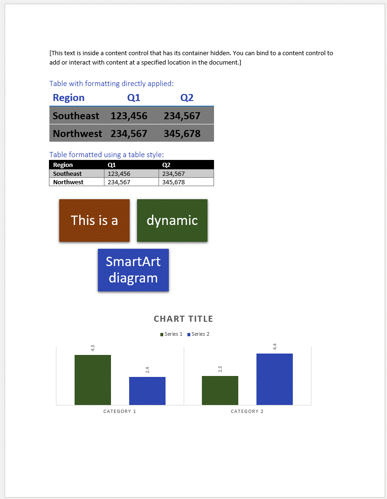
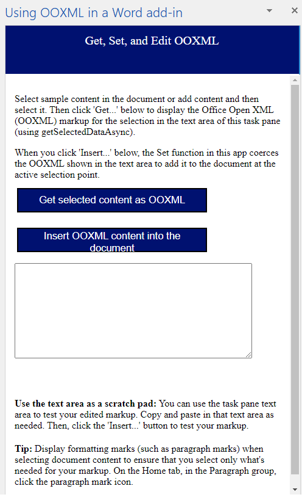

# Get, edit, and set OOXML content in a Word document with a Word add-in

## Summary

Shows how to get, edit, and set OOXML content in a Word document. This sample Word add-in provides a scratch pad to get Office Open XML for your own content and test your own edited Office Open XML snippets.

**Important**: We recommend you use APIs available in the [Word API requirement sets](https://docs.microsoft.com/office/dev/add-ins/reference/requirement-sets/word-api-requirement-sets) as your first option. For an example, see the "Insert formatted text" code snippet in [Script lab](https://aka.ms/getscriptlab) on Word. Use OOXML if the API you need isn't available or your add-in is targeting Word 2013.

## Features

- Shows the **getSelectedDataAsync** and **setSelectedDataAsync** methods to get and set OOXML content in Word 2013.
- Shows the **getOoxml** and **setOoxml** methods to get and set OOXML content in Word 2016 and later.

## Applies to

- Word on Windows, Mac, and in a browser.

## Prerequisites

- Visual Studio 2019 or later with the **Office/SharePoint development** workload installed.
- Microsoft 365 - Get a [free developer sandbox](https://developer.microsoft.com/microsoft-365/dev-program#Subscription) that provides a renewable 90-day Microsoft 365 E5 developer subscription.

## Run the sample

1. Open the **WD_OpenXML_js.sln** file in Visual Studio 2019 or later.
1. In **Solution Explorer**, select the **WD_OpenXML_js** project.
1. In the Properties window (**View** > **Properties Window**), set the **Start Action** to **Office Desktop Client**. Also set the **Start Document** to **SampleDoc.docx**.
1. Choose **Debug** > **Start Debugging** or choose the **F5** key.
1. On the **Home** tab in Word, in the **OOXML Editor** group, choose **Open**.

The SampleDoc.docx file will open in Word since it's set as the **Start Document** property of the add-in. The document contains a range of common rich content types for Word, including the following:

- formatted text
- styled text
- a formatted image
- a text box using WordArt formatting
- an Office drawing shape
- a content control that can be used for binding to a specific location in the document
- a formatted table
- a styled table
- a dynamic SmartArt graphic
- a chart

The following screenshots (Figure 1a and Figure 1b) show how the document surface appears when the solution starts and the SampleDoc.docx file is opened.

Figure 1a. SampleDoc.docx document contents.

Figure 1b. More SampleDoc.docx document contents.

**Note**

The sample uses Office Open XML (the OOXML coercion type) rather than HTML or plain text because OOXML coercion enables you to interact with virtually every type of content a user can insert in their document, such as in the examples you see in Figures 1a - 1b.

Figure 2. Task pane appearance after using the **Get…** button to extract Office Open XML for selected content.

When you select content and choose the **Get…** button, the add-in uses the JavaScript **getSelectedDataAsync** method to generate a complete Office Open XML document package that includes the selected document content, and places it in the text area of the task pane (as shown in Figure 2). Use the text area in that task pane as a scratch pad. Copy the Office Open XML markup you retrieve into an XML file, edit it to include just the information you need, and paste it back into the text area of the task pane to test your edited markup.

After you paste or edit the content in the text area of the task pane, click in a blank area of the document and then choose **Insert…** on the task pane to test the integrity of your markup. That button uses the JavaScript **setSelectedDataAsync** method to insert the contents of the task pane text area as rich content in Word, using the OOXML coercion type.

## Key components of the sample

The sample contains:

- **WD_OpenXML_js project**, which contains the WD_OpenXML_js.xml manifest file and the SampleDoc.docx document, which is prepopulated with various types of rich content.
- **WD_OpenXML_js Web project**, which contains multiple template files. However, the two files that have been developed as part of this sample solution include:
  - **WD_OpenXML_js.html** (in the Pages folder). This contains the HTML user interface that's displayed in the task pane. It consists of two HTML buttons that extract and insert Office Open XML, a DIV where status messages will be written, a text area HTML control that is used to show you Office Open XML markup, and instructional text.
  - **WD_OpenXML_js.js** (in the Scripts folder). This script file contains code that runs when the add-in is loaded. The code checks for the APIs that are supported by the host application. If the host is 2013, the application uses the common Office.js API. If the host is Word 2016 or later, the add-in uses the Word JavaScript API. This startup installs the **onclick** event handlers for the two buttons in WD_OpenXML_js.html. One of these buttons retrieves the selected document content as Office Open XML, and the other button inserts content into the document via OOXML coercion, using the contents of the text area in the task pane. All other files are automatically provided by the Visual Studio project template for an Office Add-in, and they have not been modified in the development of this sample app.

**Note**

When you use JavaScript to generate the Office Open XML markup for selected content, it creates an entire document package, which is a far larger payload than you need for inserting just your content. For help interpreting, editing, and simplifying your work with Office Open XML for a Word add-in, see [Create Better Add-ins for Word with Office Open XML](https://docs.microsoft.com/office/dev/add-ins/word/create-better-add-ins-for-word-with-office-open-xml).

## Change log

- First release: Aug 2013
- GitHub release: August 2015
- Use new Word API: October 2015
- Fix bugs and move to new samples repo: January 2022

## Related content

- [Standard ECMA-376: Office Open XML File Formats](http://www.ecma-international.org/publications/standards/Ecma-376.htm)
- [Create Better Add-ins for Word with Office Open XML](https://docs.microsoft.com/office/dev/add-ins/word/create-better-add-ins-for-word-with-office-open-xml)

This project has adopted the [Microsoft Open Source Code of Conduct](https://opensource.microsoft.com/codeofconduct/). For more information, see the [Code of Conduct FAQ](https://opensource.microsoft.com/codeofconduct/faq/) or contact [opencode@microsoft.com](mailto:opencode@microsoft.com) with any additional questions or comments.

