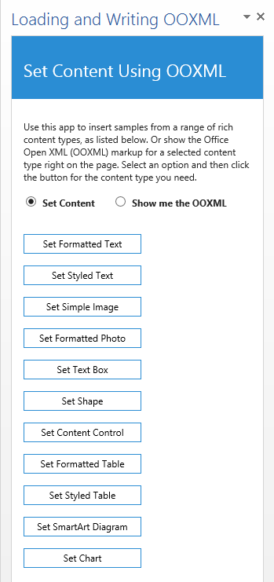
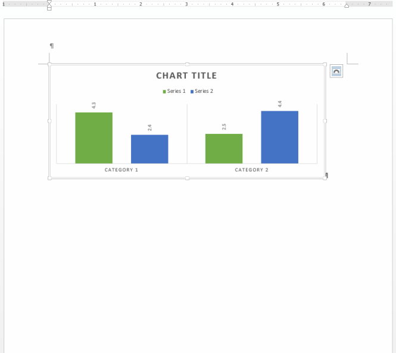
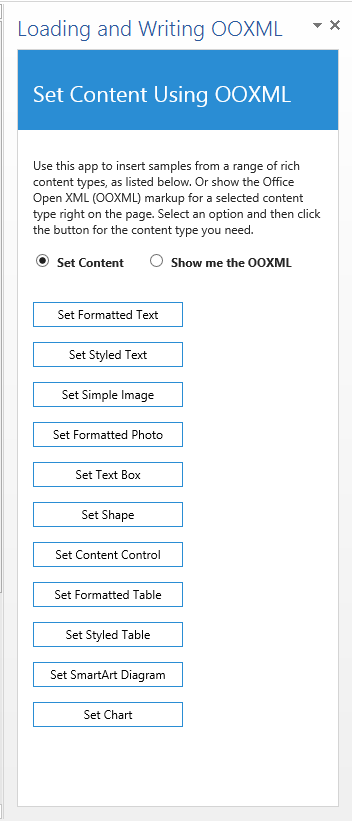

# Load and write Open XML in your Word add-in

This sample add-in shows you how to add a variety of rich content types to a Word document using the setSelectedDataAsync method with ooxml coercion type. The add-in also gives you the ability to show the Office Open XML markup for each sample content type right on the page.

**Important**: We recommend you use APIs available in the [Word API requirement sets](https://learn.microsoft.com/office/dev/add-ins/reference/requirement-sets/word-api-requirement-sets) as your first option. For an example, see the [Insert formatted text](https://github.com/OfficeDev/office-js-snippets/blob/prod/samples/word/25-paragraph/insert-formatted-text.yaml) code snippet in [Script Lab](https://appsource.microsoft.com/product/office/wa104380862) on Word. Use OOXML if the API you need isn't available.

## Description of the sample

The add-in initializes in a blank Word document. You choose an option to insert the content or its markup at the selection point in the active Word document and then click the object type you want from the following options.

* formatted text
* styled text
* a simple image
* a formatted image
* a text box
* an Office drawing shape
* a content control
* a formatted table
* a styled table
* a SmartArt diagram
* a chart

Figure 1 shows how the task pane for the sample add-in appears when the solution starts.

**Note**

When you choose the option to see the markup for a selected type of content, what you're seeing is the Office Open XML edited to remove unnecessary markup, along with a few tips for additional guidance. You can also review any piece of markup used in the add-in (with formatting to make it easier to navigate) directly in the Visual Studio solution. For further help interpreting, editing, and simplifying your work with Office Open XML for Word add-ins, see [Creating Better Add-ins for Word with Office Open XML](https://learn.microsoft.com/office/dev/add-ins/word/create-better-add-ins-for-word-with-office-open-xml).

Figures 2a - 2b show how the document surface and task pane appear after extracting Office Open XML from the selection.

## Prerequisites

This sample requires:

* Visual Studio 2019
* Microsoft 365
  * You can get a [free developer sandbox](https://developer.microsoft.com/microsoft-365/dev-program#Subscription) that provides a renewable 90-day Microsoft 365 E5 developer subscription.

## Key components of the sample

The sample add-in contains:

* The LoadingAndWritingOOXML project, which contains the LoadingAndWritingOOXML.xml manifest file.
* The LoadingAndWritingOOXML Web project, which contains multiple template files. However, the files that have been developed as part of this sample solution include:
  * LoadingAndWritingOOXML.html (in the App folder, LoadingAndWritingOOXML subfolder). This contains the HTML user interface that is displayed in the task pane. It consists of two HTML radio buttons for choosing the option to insert a selected content type or display its markup in Word, several buttons for selecting a content type, and instructional text
  * LoadingAndWritingOOXML.js (in the same folder as above). This script file contains code that runs when the add-in is loaded. This startup wires up the Click event handlers for the eleven buttons in LoadingAndWritingOOXML.html that represent different content types. The handler in the JavaScript connects each button to the correct function based on the actively-selected radio button, to either write the content or its markup into the document.
  * Several XML files containing the markup for each of the content types you can insert via the add-in. These are located in the folder named OOXMLSamples. (Note that some content types have a separate XML file for the markup when inserting the object vs. displaying the markup on the page because chunks of binary data where applicable (i.e., for pictures and charts) are removed from the markup displayed on the page for ease of review. To learn more about the binary data contained in some types of Office Open XML markup, see the previously-referenced article  Creating Better Add-ins for Word with Office Open XML

All other files are automatically provided by the Visual Studio project template for Add-ins for Office, and they have not been modified in the development of this sample add-in.

## Configure the sample

To configure the sample, open the LoadingAndWritingOOXML.sln file with Visual Studio. No other configuration is necessary.

## Build the sample

To build the sample, choose the Ctrl+Shift+B keys.

## Run and test the sample

To run the sample, choose the F5 key.

## Troubleshooting

If the add-in fails to respond as described, try reloading it. (In the task pane, choose the down arrow, and then select **Reload**.)

## Related content

* [Word add-ins documentation](https://learn.microsoft.com/office/dev/add-ins/word/)
* [Standard ECMA-376: Office Open XML File Formats](http://www.ecma-international.org/publications/standards/Ecma-376.htm)
* [Create better add-ins for Word with Office Open XML](https://learn.microsoft.com/office/dev/add-ins/word/create-better-add-ins-for-word-with-office-open-xml?redirectedfrom=MSDN)

## Questions and feedback

- Did you experience any problems with the sample? [Create an issue](https://github.com/OfficeDev/Office-Add-in-samples/issues/new/choose) and we'll help you out.
- We'd love to get your feedback about this sample. Go to our [Office samples survey](https://aka.ms/OfficeSamplesSurvey) to give feedback and suggest improvements.
- For general questions about developing Office Add-ins, go to [Microsoft Q&A](https://learn.microsoft.com/answers/topics/office-js-dev.html) using the office-js-dev tag.

## Copyright

Copyright (c) 2021 Microsoft Corporation. All rights reserved.

This project has adopted the [Microsoft Open Source Code of Conduct](https://opensource.microsoft.com/codeofconduct/). For more information, see the [Code of Conduct FAQ](https://opensource.microsoft.com/codeofconduct/faq/) or contact [opencode@microsoft.com](mailto:opencode@microsoft.com) with any additional questions or comments.

