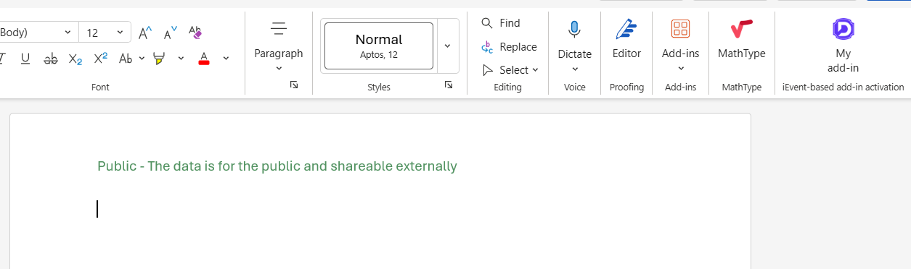

# Automatically add labels with an add-in when a Word document opens

## Summary

This sample shows how to configure an add-in to automatically run when a Word document opens. It adds a header to indicate the content's sensitivity.

## Description

The add-in acts when the `OnDocumentOpened` event occurs. The `changeHeader` function is a JavaScript event handler for this event. It adds either a "Public" header to new documents or a "Highly Confidential" header to existing documents that already have content. Some of the functionality is duplicated in the task pane to allow for manual changes.

This sample is designed for Word, but the event-based activation architecture will also work for Excel and PowerPoint.

### Event-based activation deployment limitations

Event-based activation works only when the add-in deployed by an administrator in the Microsoft 365 tenant Admin center. It doesn't work if the add-in is sideloaded or installed by a user from Microsoft Marketplace, although other features of the add-in would work.

For more information, see [Deploy and publish Office Add-ins in the Microsoft 365 admin center](https://learn.microsoft.com/microsoft-365/admin/manage/office-addins).

## Applies to

- Word on Windows
- Word on the web

## Prerequisites

- Office connected to a Microsoft 365 subscription (including Office on the web).
- [Node.js](https://nodejs.org/) (latest recommended version).
- [npm](https://docs.npmjs.com/downloading-and-installing-node-js-and-npm) version 8 or greater.

## Solution

| Solution | Authors |
|----------|-----------|
| How to configure a Word add-in to activate when a document opens. | Microsoft |

## Version history

| Version  | Date | Comments |
|----------|------|----------|
| 1.0 | 06-30-2025 | Initial release |
| 1.1 | 09-01-2026 | Bug fixes |

## Install the sample for testing

1. Clone or download this repo.
1. In a command prompt, navigate to the folder where you cloned or downloaded this repo and then to the **Samples\word-add-label-on-open** folder.
1. Run `npm install`.
1. Run `npm run build:dev`.
1. Run `npm run dev-server`.

    > **Note**: Do *not* run `npm start`. You aren't sideloading the add-in, and attempting to sideload it could result in two copies of the add-in installed, and it is random which handler Word will run. It is For more information, see [Optionally sideload](#optionally-sideload).

1. In the Microsoft 365 admin portal, expand the **Settings** section in the navigation pane then select **Integrated apps**.
1. On the **Integrated apps** page, choose the **Upload custom apps** action.
1. On the **Upload Apps to deploy** page, select **Office Add-in** from the **App type** drop down.
1. In the **Choose how to upload app** section, select **Upload manifest file (.xml) from device**.
1. Use the file picker to navigate to the folder where you cloned or downloaded this repo and then to the **Samples\word-add-label-on-open** folder.
1. Select the `manifest.xml` file.
1. Select **Just me** as the user. 
1. Follow the instructions on screen to finish the deployment.

> :exclamation: **Important:** You cannot run the add-in until after it has propagated to a platform. Propogation to Word on the web can take several hours, typically 2 to 3 hours. Propogation to Word on Windows can take 24 hours, typically 6 to 12 hours.
>
> To test whether the add-in has propogated, see [Try it out](#try-it-out).

## Try it out

1. In either Word on the web or Word on Windows, try opening both new and existing Word documents. If the add-in has propagated to the platform, headers should automatically be added when the document opens, and there should be a **My Add-in** button in an **Event-activated add-in** group on the **Home** tab of the ribbon. If these things don't happen, propogation to the platform has not completed. Close Word and try again in a while.
1. Select the **My add-ins** button to open the task pane.
1. Select any of the links on the task pane to add/change the header.

    > **Note:** If you save the document and reopen it, the event handler changes the header to "Public" or "Highly Confidential". See [Description](#description).

> **Important:** When you finish a testing session, run `npm stop` to shut down the server. When you are finished working with the sample, [uninstall it](#uninstall-the-add-in).

## Make it yours

The following are a few suggestions for how you could tailor this to your scenario.

- Add more complex logic to categorize the headers based on the content of the file.
- Apply the `OnDocumentOpened` event logic to an Excel or PowerPoint add-in.

Whenever you make a change in the manifest, you must [uninstall the add-in](#uninstall-the-add-in) and then reinstall it. This requires waiting for propagation twice. Uninstallation is not required for changes to any of the other files. If changes to those files don't seem to take effect, take the following steps in a command prompt in the root of the project.

1. Shut down the server with `npm stop`.
1. Run `npm run build:dev`.
1. Run `npm run dev-server`.

## Uninstall the add-in 

To uninstall the add-in, take the following steps:

1. In the Microsoft 365 admin portal, expand the **Settings** section in the navigation pane then select **Integrated apps**.
1. On the **Integrated apps** page, select the add-in.
1. On the add-in's flyout, select **Remove app**.
1. On the **Remove apps** page, confirm that you want to remove the app and select **Remove**.
1. On the **Successfully removed** page, select **Done**.

> :exclamation: **Important:** Uninstallation must propagate to the platforms just as installation does. Propogation to Word on the web can take several hours, typically 2 to 3 hours. Propogation to Word on Windows can take 24 hours, typically 6 to 12 hours.
>
> To test if uninstallation has propagated, open a Word file on the platform. If the **My Add-in** button in an **Event-activated add-in** group is still on the **Home** tab of the ribbon, propagation has not happened. Close Word and try again in a while.

## Optionally sideload

The long wait for propagation after installation (or uninstallation) is only needed when you are testing changes to the `OnDocumentOpened` handler. If you only want to work with the task pane, you can sideload the add-in with these steps.

1. [Uninstall the add-in](#uninstall-the-add-in). You must do this before sideloading to ensure that you aren't running two add-ins handling the same event. You will need to wait for propagation of the uninstallation, but then you can sideload and re-sideload as much as you want without further waiting.
1. When the uninstallation has propagated, open a command prompt in the root of the project and run `npm start` to build the project, launch the web server, and sideload the add-in in Word.
1. When you finish a testing session, run `npm stop` to unregister the add-in and shut down the server.

## Related content

- [Activate add-ins with events](https://learn.microsoft.com/office/dev/add-ins/develop/event-based-activation)
- [Debug event-based or spam-reporting add-ins](https://learn.microsoft.com/office/dev/add-ins/testing/debug-autolaunch)
- [Word add-ins documentation](https://learn.microsoft.com/office/dev/add-ins/word/)

## Questions and feedback

- Did you experience any problems with the sample? [Create an issue](https://github.com/OfficeDev/Office-Add-in-samples/issues/new/choose) and we'll help you out.
- We'd love to get your feedback about this sample. Go to our [Office samples survey](https://aka.ms/OfficeSamplesSurvey) to give feedback and suggest improvements.
- For general questions about developing Office Add-ins, go to [Microsoft Q&A](https://learn.microsoft.com/answers/topics/office-js-dev.html) using the office-js-dev tag.

## Copyright

Copyright (c) 2025 Microsoft Corporation. All rights reserved.

This project has adopted the [Microsoft Open Source Code of Conduct](https://opensource.microsoft.com/codeofconduct/). For more information, see the [Code of Conduct FAQ](https://opensource.microsoft.com/codeofconduct/faq/) or contact [opencode@microsoft.com](mailto:opencode@microsoft.com) with any additional questions or comments.

