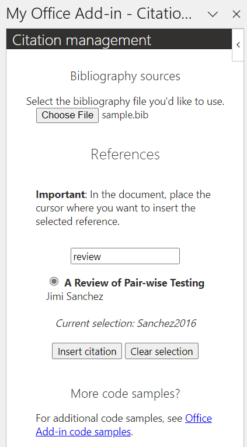
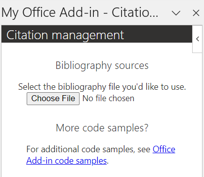
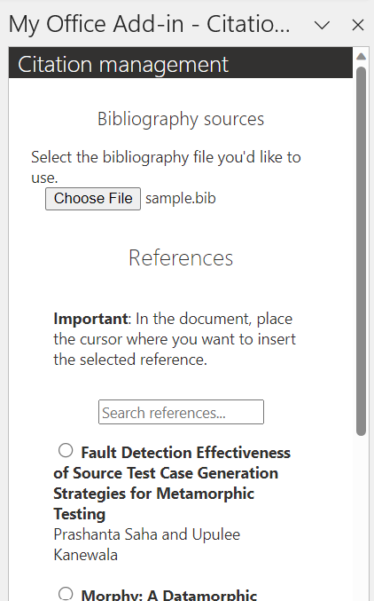
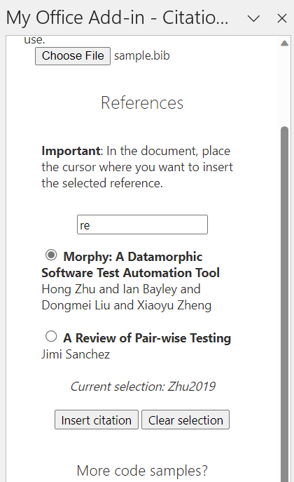

# Manage citations in a Word document

## Summary

This sample shows the basics of managing citations with an add-in in a Word document. The add-in uses the [insertEndnote API](https://learn.microsoft.com/javascript/api/word/word.range?view=word-js-1.5#word-word-range-insertendnote-member(1)) to list inserted citations at the end of the document.

For documentation related to this sample, see [Citation management article](https://learn.microsoft.com/office/dev/add-ins/word/citation-management).

## Description

The user updates their Word document to include their citations and quotations. The user selects their bibliography file (.bib) through the add-in UI. The add-in lists the references found in the .bib file. The user selects the text in the document that they want to cite then picks the option from the reference list displayed in the add-in UI. The inserted citations are listed at the end of the document.

The sample also depends on [@orcid/bibtexParseJs](https://github.com/ORCID/bibtexParseJs#readme), a JavaScript library for parsing the .bib file.

## Applies to

- Word on Windows
- Word on Mac
- Word on the web

## Prerequisites

- Office connected to a Microsoft 365 subscription (including Office on the web).
- [Node.js](https://nodejs.org/) version 16 or greater.
- [npm](https://docs.npmjs.com/downloading-and-installing-node-js-and-npm) version 8 or greater.

- [@orcid/bibtexParseJs](https://github.com/ORCID/bibtexParseJs#readme).

## Solution

| Solution | Authors |
|----------|-----------|
| How to manage citations in a Word document | Microsoft |

## Version history

| Version  | Date | Comments |
|----------|------|----------|
| 1.0 | 11-15-2023 | Initial release |

## Run the sample

1. Clone or download this repo.

1. Go to the **Samples\word-citation-management** folder via the command line.

1. Run `npm install`.

1. Run `npm run build`.

1. Start the local web server and sideload your add-in.

    - To test your add-in in Word, run the following command in the root directory of your project. This starts the local web server (if it's not already running) and opens Word with your add-in loaded.

      - Windows: `npm start`
      - Mac: `npm run dev-server`

    - To test your add-in in Word on the web, follow the instructions in [Sideload a Yeoman-created add-in to Office on the web](https://learn.microsoft.com/office/dev/add-ins/testing/sideload-office-add-ins-for-testing#sideload-a-yeoman-created-add-in-to-office-on-the-web).

1. If the add-in task pane isn't already open in Word, go to the Home tab and choose the **Show Taskpane** button in the ribbon to open it.

## Try it out

1. In the "Bibliography sources" section of the add-in UI, select the **Choose File** button. Navigate to the local location of your .bib file then open the file.

    

    For convenience, the assets folder of this project includes a sample.bib file that you can use for testing.

    

1. In the document, select the text that you cited or quoted, or place the cursor.

    

1. In the list of references in the "References" section of the add-in UI, search for and select the reference you want to insert then select the **Insert citation** button. To unselect the selected radio button, choose the **Clear selection** button.

    

1. In the document, the reference mark appears at the end of the selected text and an endnote with the reference information is displayed at the end of the document.

    

## Make it yours

The following are a few suggestions for how you could tailor this to your scenario.

- Include [single sign-on (SSO)](https://learn.microsoft.com/office/dev/add-ins/develop/sso-in-office-add-ins) to support managing sessions and persisting settings for the user.
- Update the citation style used to display the references in the endnotes, or allow the user to choose the style.
- Use [footnotes](https://learn.microsoft.com/javascript/api/word/word.range?view=word-js-1.5#word-word-range-insertfootnote-member(1)) instead of endnotes, or allow the user to choose.

## Related content

- [Word add-ins documentation](https://learn.microsoft.com/office/dev/add-ins/word/)

## Questions and feedback

- Did you experience any problems with the sample? [Create an issue](https://github.com/OfficeDev/Office-Add-in-samples/issues/new/choose) and we'll help you out.
- We'd love to get your feedback about this sample. Go to our [Office samples survey](https://aka.ms/OfficeSamplesSurvey) to give feedback and suggest improvements.
- For general questions about developing Office Add-ins, go to [Microsoft Q&A](https://learn.microsoft.com/answers/topics/office-js-dev.html) using the office-js-dev tag.

## Copyright

Copyright (c) 2023 Microsoft Corporation. All rights reserved.

This project has adopted the [Microsoft Open Source Code of Conduct](https://opensource.microsoft.com/codeofconduct/). For more information, see the [Code of Conduct FAQ](https://opensource.microsoft.com/codeofconduct/faq/) or contact [opencode@microsoft.com](mailto:opencode@microsoft.com) with any additional questions or comments.

