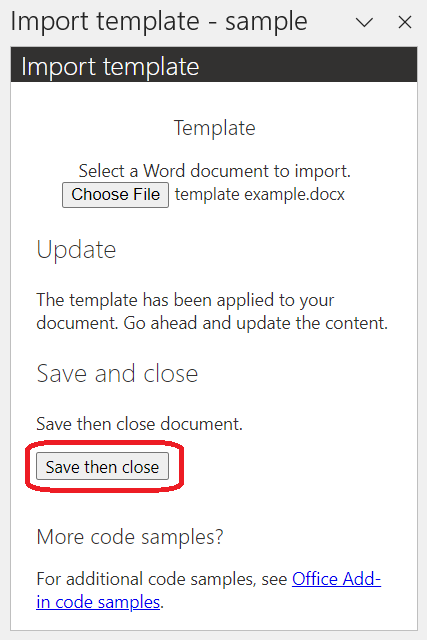

# Import templates in a Word document

## Summary

This sample shows how to import a Word document template with an add-in.

## Description

The user updates their Word document with the content from another Word document, treating the external document like a template. The user selects a Word document through the add-in UI then it's applied to the current document.

## Applies to

- Word on Windows
- Word on Mac
- Word on the web

## Prerequisites

- Office connected to a Microsoft 365 subscription (including Office on the web).
- [Node.js](https://nodejs.org/) version 16 or greater.
- [npm](https://docs.npmjs.com/downloading-and-installing-node-js-and-npm) version 8 or greater.

## Solution

| Solution | Authors |
|----------|-----------|
| How to import a template in a Word document | Microsoft |

## Version history

| Version  | Date | Comments |
|----------|------|----------|
| 1.0 | 03-08-2024 | Initial release |

## Run the sample

1. Clone or download this repo.

1. Go to the **Samples\word-import-template** folder via the command line.

1. Run `npm install`.

1. Run `npm run build`.

1. Start the local web server and sideload your add-in.

    - To test your add-in in Word, run the following command in the root directory of your project. This starts the local web server (if it's not already running) and opens Word with your add-in loaded.

      - Windows: `npm start`
      - Mac: `npm run dev-server`

    - To test your add-in in Word on the web, follow the instructions in [Sideload a Yeoman-created add-in to Office on the web](https://learn.microsoft.com/office/dev/add-ins/testing/sideload-office-add-ins-for-testing#sideload-a-yeoman-created-add-in-to-office-on-the-web).

1. If the add-in task pane isn't already open in Word, go to the Home tab and choose the **Show Task Pane** button in the ribbon to open it.

## Try it out

1. In the "Template" section of the add-in UI, select the **Choose File** button. Navigate to the location of your .docx file then open the file. The template is automatically applied to your document.

    

    For convenience, the resources folder of this project includes a *template example.docx* file.

    

1. In the document, update the text and other content.

1. In the "Save and close" section of the add-in UI, select the **Save then close** button.

    

## Make it yours -- TODO: Update

The following are a few suggestions for how you could tailor this to your scenario.

- Include [single sign-on (SSO)](https://learn.microsoft.com/office/dev/add-ins/develop/sso-in-office-add-ins) to support managing sessions and persisting settings for the user.
- Update the citation style used to display the references in the endnotes, or allow the user to choose the style.
- Use [footnotes](https://learn.microsoft.com/javascript/api/word/word.range#word-word-range-insertfootnote-member(1)) instead of endnotes, or allow the user to choose.

## Related content

- [Import template](https://learn.microsoft.com/office/dev/add-ins/word/import-template)
- [Word add-ins documentation](https://learn.microsoft.com/office/dev/add-ins/word/)

## Questions and feedback

- Did you experience any problems with the sample? [Create an issue](https://github.com/OfficeDev/Office-Add-in-samples/issues/new/choose) and we'll help you out.
- We'd love to get your feedback about this sample. Go to our [Office samples survey](https://aka.ms/OfficeSamplesSurvey) to give feedback and suggest improvements.
- For general questions about developing Office Add-ins, go to [Microsoft Q&A](https://learn.microsoft.com/answers/topics/office-js-dev.html) using the office-js-dev tag.

## Copyright

Copyright (c) 2024 Microsoft Corporation. All rights reserved.

This project has adopted the [Microsoft Open Source Code of Conduct](https://opensource.microsoft.com/codeofconduct/). For more information, see the [Code of Conduct FAQ](https://opensource.microsoft.com/codeofconduct/faq/) or contact [opencode@microsoft.com](mailto:opencode@microsoft.com) with any additional questions or comments.

