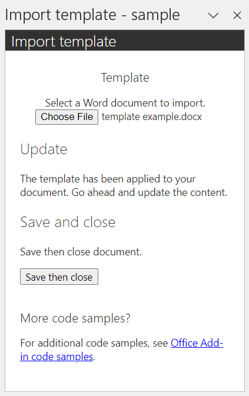
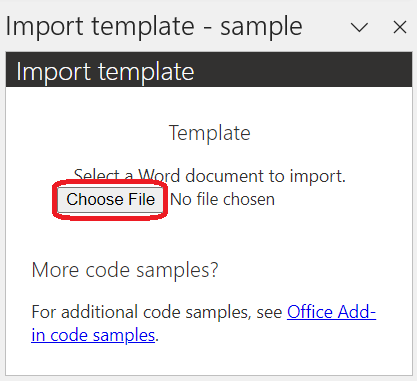
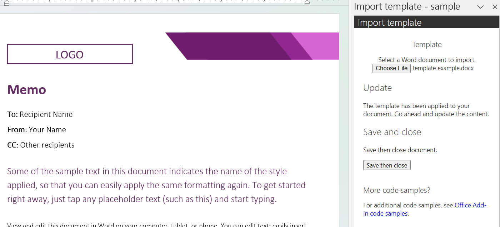

# Import templates in a Word document

## Summary

This sample shows how to import a Word document template with an add-in.

## Description

The user updates their Word document with the content from another Word document, treating the external document like a template. The user selects a Word document through the add-in UI then it's applied to the current document.



## Applies to

- Word on Windows
- Word on Mac
- Word on the web

## Prerequisites

- (Optional) If you want to run the web server on localhost, install a recent version of [npm](https://www.npmjs.com/get-npm) and [Node.js](https://nodejs.org) on your computer. To check if you've already installed these tools, from a command prompt, run the following commands.

    ```console
    node -v
    npm -v
    ```

- (Optional) If you want to run the sample with a [unified manifest for Microsoft 365](https://learn.microsoft.com/office/dev/add-ins/develop/json-manifest-overview) using GitHub as the web host, install the [Microsoft 365 Agents Toolkit command line interface (CLI)](https://learn.microsoft.com/microsoftteams/platform/toolkit/teams-toolkit-cli). From a command prompt, run the following command.

    ```console
    npm install -g @microsoft/teamsapp-cli
    ```

- (Optional) If you want to deploy the sample with the unified manifest for Microsoft 365 to Microsoft Azure, you'll need the following:
  - An Azure subscription.
  - [Visual Studio Code](https://code.visualstudio.com/).
- [Microsoft 365 Agents Toolkit extension for Visual Studio Code](https://learn.microsoft.com/microsoftteams/platform/toolkit/install-teams-toolkit).

## Solution

| Solution | Authors |
|----------|-----------|
| How to import a template in a Word document | Microsoft |

## Version history

| Version  | Date | Comments |
|----------|------|----------|
| 1.0 | 03-08-2024 | Initial release |
| 1.1 | 05-22-2025 | Convert to the unified manifest for Microsoft 365 |

## Run the sample

You can run this sample in Word on Windows, on Mac, or in a browser. Use one of the following add-in file hosting options.

### Use GitHub as the web host

The quickest way to run the sample is to use GitHub as the web host. However, you can't debug or change the source code. The add-in web files are served from this GitHub repository.

1. Download the **word-import-template.zip** file from this sample to a folder on your computer.
1. Sideload the add-in manifest in Word by following the appropriate instructions in the article [Sideload Office Add-ins that use the unified manifest for Microsoft 365](https://learn.microsoft.com/office/dev/add-ins/testing/sideload-add-in-with-unified-manifest).
1. Follow the steps in [Try it out](#try-it-out) to test the sample.

### Use localhost

If you prefer to host the web server on localhost, follow these steps.

1. Clone or download this repository.
1. From a command prompt, go to the root of the project folder **/samples/word-import-template**.
1. Run the following commands.

    ```console
    npm install
    ```

    ```console
    npm start
    ```

    This starts the web server on localhost and sideloads the **manifest.json** file to Word.

1. Follow the steps in [Try it out](#try-it-out) to test the sample.

1. To stop the web server and uninstall the add-in from Word, run the following command.

    ```console
    npm stop
    ```

### Use Microsoft Azure

You can deploy this sample with the unified manifest to Microsoft Azure using the Microsoft 365 Agents Toolkit extension in Visual Studio Code.

1. In Visual Studio Code, go to the activity bar, then open the Microsoft 365 Agents Toolkit extension.
1. In the Accounts section of the Teams Toolkit pane, choose **Sign in to Azure**.
1. After you sign in, select a subscription under your account.
1. In the Development section of the Teams Toolkit pane, choose **Provision in the cloud**. Alternatively, open the command palette and choose **Teams: Provision in the cloud**.
1. Choose **Deploy to the cloud**. Alternatively, open the command palette and choose **Teams: Deploy to the cloud**.

Once the sample is successfully deployed, follow these steps.

1. Copy the endpoint of your new Azure deployment. Use one of the following methods.
    - In Visual Studio Code, select **View** > **Output** to open the Output window. Then, copy the endpoint for your new Azure deployment.
    - In the Azure portal, go to the new storage account. Then, choose **Data management** > **Static website** and copy the **Primary endpoint** value.
1. Open the **./webpack.config.js** file.
1. Change the `urlProd` constant to use the endpoint of your Azure deployment.
1. Save your change. Then, run the following command.

    ```console
    npm run build
    ```

    This generates a new **manifest.json** file in the **dist** folder of your project that will load the add-in resources from your storage account.
1. Run the following command.

    ```console
    npm run start:prod
    ```

    Word on Windows starts and the **manifest.json** file is sideloaded from the **dist** folder.
1. Follow the steps in [Try it out](#try-it-out) to test the sample.
1. To stop the web server and uninstall the add-in from Word, run the following command.

    ```console
    npm run stop:prod
    ```

## Try it out

Once the add-in is loaded, use the following steps to try out the functionality.

1. Open Word on Windows, on Mac, or in a browser.

1. To open the add-in task pane, go to the **Home** tab and choose **Show Task Pane**.

1. In the "Template" section of the add-in UI, select **Choose File**. Navigate to the location of your .docx file then open the file. The template is automatically applied to your document, replacing any preexisting content.

    

    For convenience, the resources folder of this project includes a *template example.docx* file.

    

1. In the document, update the text and other content.

## Make it yours

The following are a few suggestions for how you could tailor this to your scenario.

- Include [single sign-on (SSO)](https://learn.microsoft.com/office/dev/add-ins/develop/sso-in-office-add-ins) to support managing sessions and persisting settings for the user.
- Provide personalized or company-approved templates for users to access.
- Enable users to personalize templates and save to shared location.

## Related content

- [Import template](https://learn.microsoft.com/office/dev/add-ins/word/import-template)
- [Word add-ins documentation](https://learn.microsoft.com/office/dev/add-ins/word/)

## Questions and feedback

- Did you experience any problems with the sample? [Create an issue](https://github.com/OfficeDev/Office-Add-in-samples/issues/new/choose) and we'll help you out.
- We'd love to get your feedback about this sample. Go to our [Office samples survey](https://aka.ms/OfficeSamplesSurvey) to give feedback and suggest improvements.
- For general questions about developing Office Add-ins, go to [Microsoft Q&A](https://learn.microsoft.com/answers/topics/office-js-dev.html) using the office-js-dev tag.

## Copyright

Copyright (c) 2024 Microsoft Corporation. All rights reserved.

This project has adopted the [Microsoft Open Source Code of Conduct](https://opensource.microsoft.com/codeofconduct/). For more information, see the [Code of Conduct FAQ](https://opensource.microsoft.com/codeofconduct/faq/) or contact [opencode@microsoft.com](mailto:opencode@microsoft.com) with any additional questions or comments.


